#### *Update: Livia made a wonderful video to go along with this post. You can find it embedded at the bottom of this post. 

So... It's been a while, hasn't it?

**Sorry everyone!**

I just can't believe that it has been nearly 2 months since our last blog post went out. Time just flies by! I have been meaning to write another post for a long time but the truth is, with the limited free time that we have to do things like this I have been prioritizing other projects over my writing and for that I apologize. The looming end of our trip and beginning of job search for a career that I have no official work experience in, has left me scrambling to build up a portfolio of code so I can find work when I return. If any of you are interested in what I've been up to in that regard, feel free to check out my personal website at **[Tim Baker Development](http://timbakerdev.com?target=_blank)**. I have been doing some work that is not on there yet as well, in the areas of mobile app development and machine learning.

I believe a large part of what has kept me from doing another post at this point is just how far we are behind and how many posts I was feeling like I would have to write to catch up. As such, I have decided that the only way to get back on track at this point is to do one large post recapping all of the highlights of our trip for our time through Malaysia and our short time back in Thailand. I will write about our time in Vietnam seperately and in more detail. For this post, I'm going to do my best to only highlight the exciting bits and leave out as many unnecessary details as possible. Nevertheless ... this one is going to be VERY long. If you stick with it and read the whole thing then I commend you!

Now then, let's get started:

##### Kuala Lumpur
I figure the best way to do our section on Kuala Lumpur is to follow the format of the video Livia made for 8 things to do in Kuala Lumpur (you can watch it below). There are of course many other things to do in uala Lumpur to do but we'll stick to the things we did and enjoyed most. 

I'd like to start with our first impression of Kuala Lumpur and of Malaysia itself:

With Bangkok being our only other experience of major Asian city, we couldn't help but spend a good portion of the time sub-consciously comparing the two. We certainly found Kuala Lumpur to be much more comfortable. It is a far more modern and advanced city and really shared very few similarities. We stayed in the Old Town region and even still it was less primitive than most of Bangkok and the major areas in the downtown are arguably as advanced and upscale as those back home. This was a nice change and one of the things we enjoyed most was that the majority of people that we dealt with on a day to day basis in Malaysia spoke reasonable English. We are comfortable by now in areas where English is sparse and you must communicate in other ways, but it is always nice when you can communicate freely.

Well, I guess now is as good of a time as any to get into our 8 things to do in Kuala Lumpur:

1. ##### KLCC Park
* KLCC stands for Kuala Lumpur City Center and the park there is beautiful! It is smack dab in the middle of the more upscale area surrounded by high-rises and upscale malls, including the attached KLCC Mall and with the famous Petronas Twin Towers looming overhead. It is really nice to see this large chunk of natural greenspace with real grass and a nice water fountain and pool. It really is a bit sad that seeing grass is that exciting, but what are you gonna do? Nevertheless it was really nice to get here in the morning to grab a coffee and have a nice walk around.

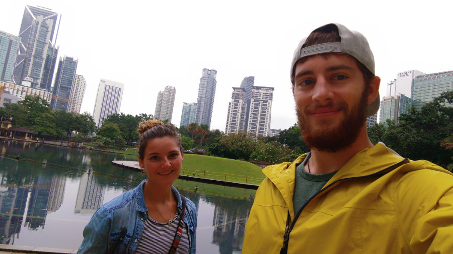

<b>Just us at KLCC Park</b>

2. ##### Fountain Show
* I suppose this one could be combined with the above item, but we felt it deserved it's own. Every night from 6pm until 11pm at the fountain in the above-mentioned KLCC Park, there is a famous water fountain show. You can watch the sunset as the fountains begin to shoot and dance around and when it gets dark it lights up in a dazzling display of colors and patterns. It really makes for an nice night out and from here you can also admire the Petronas Towers, lit up in all their glory.

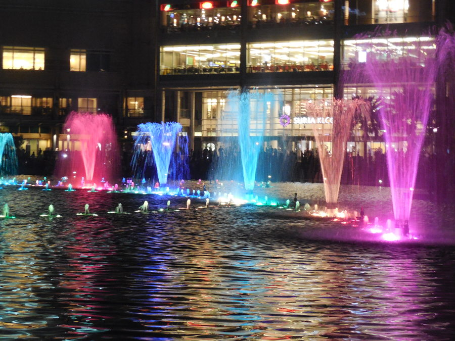

<b>KLCC Fountain Show</b>

3. ##### Central Market and Petaling Street
* These are actually two seperate markets, but you almost wouldn't know. The Petaling street is the sprawling market in Chinatown and its borders extend right up to the building which houses the Central Market. You can find nearly anything here and, depending on your haggling skills, you can either get amazing deals and discounts or pay WAY too much for things. But hey, that's part of the fun! We didn't spend too much time here since everything that we buy has to find some place in our bag for the following 4 months. I did however end up buying two really nice watches from a lady for less than $20CAD. One is an "Omega" and the other is a "Rolex." The quotations are of course meant to mean that I am fully aware, as everyone should be, that they are fakes. If you go here expecting to find any real brand name items for cheap, you will be sorely disappointed. That said, 2 months later and the Omega is still functioning perfectly and the Rolex has not even been opened. Much better lifespan than any cheap watch I have gotten in Canada.

4. ##### National Museum
* In an attempt to feel a bit less like the clueless tourists we are, we spent a day at the National Museum. It was a great experience and I'm really glad that we chose to do it. For the $2/person entry fee, why not? I can wholeheartedly say that we are still pretty clueless but at least we tried! We did come out with a much better idea of the history of Malaysia than we had previously though, and have decided that it is a pretty good practice whenever we enter a new significant area or country to try to go to the local museum. We have gone on to do museum tours of Panang and Vietnam, but I'll get to those another time.

5. ##### Batu Caves
* The Batu Caves are a big tourist draw in Kuala Lumpur and they are pretty cool. I must say, they are a little underwhelming though. There is a massive staircase up to the main cave, which opens up into a huge cavern in the mountain with a temple in it but all in all, there isn't much to it. They did have a thing for quite some time where you could volunteer to carry a brick up the staircase to help rebuild part of the temple inside but when they went they already had enough so we couldn't. I guess that's score one for tourism, eh? The part that we really liked about this little excursion actually comes next at the Dark Cave Tour.

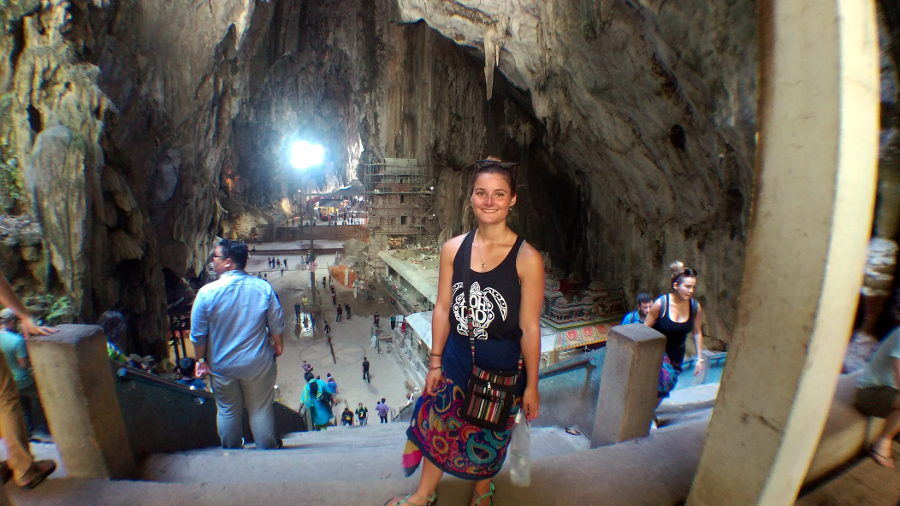

<b>Batu Caves - Liv needed to rent a Sarong to cover her legs</b>

6. ##### Dark Cave Tour
* About halfway up the massive staircase discussed above, another staircase veers off to the left and actually takes you to a much more interesting cave. The Dark cave is a protected site and you can only go in with a tour, but the tickets were only $5/each and was totally worth it. We all got suited up with hard hats and flashlights and ventured into the cave. When they say Dark Cave they aren't kidding. After a short ways in, they had us all turn off our flashlights and it was complete darkness. Like, can't see your hand in front of your face at all darkness. It was pretty cool but the best bit was at the turn-around point in the cave. While going through the cave in complete darkness we could see all sorts of cave-dwelling insects and spiders and we eventually came to an area with light. At the turn-around spot, there is a big hole in the roof of the cave and the light shines through in one direct beam.

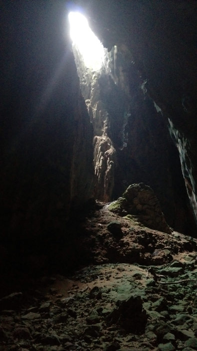

<b>The only source of light in the cave</b>

7. ##### Heli Lounge Bar
* This was probably the most unique experience we had in KL. It is essentially a bar on a heli-pad on the roof of one of the tallest towers in KL. By day, it is a fully-functioning helicopter landing pad. But after 5pm they stop operating, bring tables and chairs onto the pad and turn it into a bar. There is no entry fee except for your drinks. You get out of the elevator on the top floor and must buy a drink before you can go up the stairs onto the pad itself. Drinks are a little pricey for KL, but was still only $10 for a Guiness and entry to this crazy bar. The part we couldn't believe was the lack of a railing. About 5 feet away from the edge (which is just a drop off all the way to the ground) they have bank-line like ribon to warn you that you are close. Just don't get too drunk here! It is so scenic though to watch the sunset and the city skyline light up below you. Unfortunately, the footage we got from up here turned out horribly, but you can see what we got in the video. 

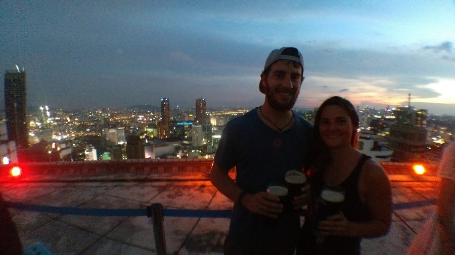

<b>Our camera really struggled up here for some reason. Unfortunately, this is the best we've got</b>

8. ##### Reggae Mansion Rooftop Bar
* Reggae Mansion is the hostel that we stayed at during our time in KL. It was a really cool place and mansion is the right word to describe it. There was enough staircases and different, nearly identical, areas that you could actually get lost in it (and Liv did a few times haha). It even had a theater room, which was unfortunately down for maintenance during our stay. But by night, we would go and get our free drink tickets for the night and head up to the bar on the roof and play beer pong and meet other travellers. It is really the kind of place to party every night if that's what you're into. We met a lot of cool people here and made some friends that we still keep up with 2 months later. A few we've actually met back up with later on in the trip, I'll mention them later.

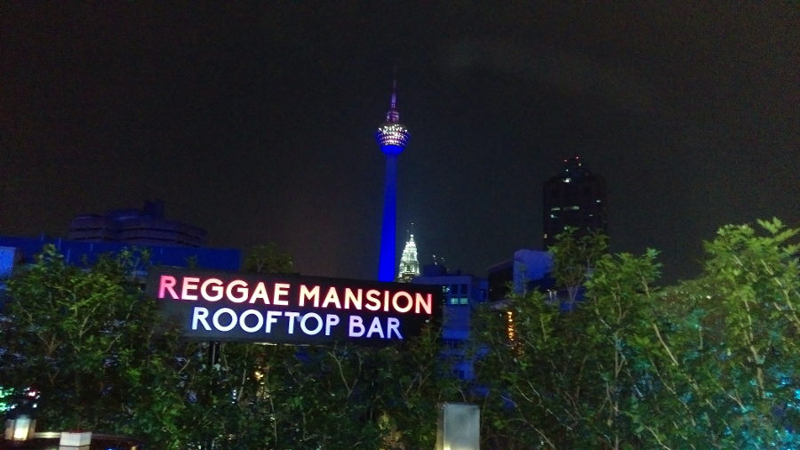

<b>Reggae Mansion Rooftop Bar</b>

And finally, as promised, here is Livia's video:

[plugin:youtube](https://www.youtube.com/watch?v=lvjIPuqgM-0)

<b>8 Things to Do in Kuala Lumpur</b>
 

##### Cameron Highlands
Following KL, we made our way up into the mountains of the Cameron Highlands for 3 days. There is a decent amount to do up in this region but unfortunately Liv got really sick shortly after we arrived and it lasted most of our time there (we think altitude sickness). The area is beautiful though, and is amplified after having been in the ol' concrete jungle for a while. All nature is just that much better after that. The mountain air was crisp but fresh and people were rocking Northern Canada style winter coats and giving us quizzical looks as we strolled happily around in t-shirts. The big highlight of this little trip was our trip to the Bharat Tea Plantation. The valleys here are made up of tea plantations as far as the eye can see and we visited one that was turned into a cafe and restaurant. You could wander into the valley and throughout the plantation and then grab a cup of fresh tea (which is exactly what we did). After some exploring, we went and had ourselves the best cup of freshly grown Masala Chai tea we've ever tasted and fresh baked apple pie. We're real glad we didn't pass up Cameron Highlands as we almost did. Thanks Liv, for forcing me into it :)  

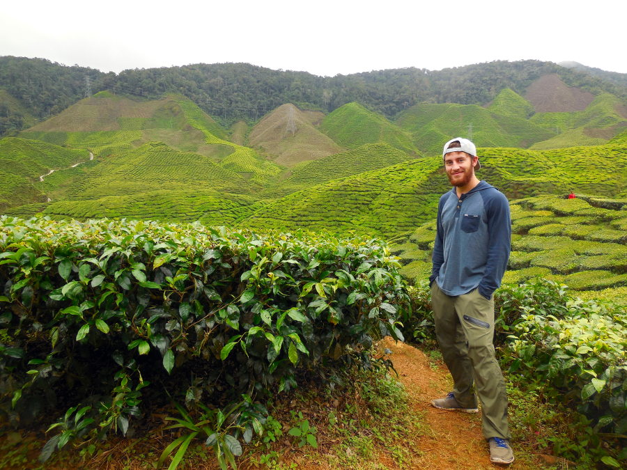

<b>Standing amongst the tea plantation</b>

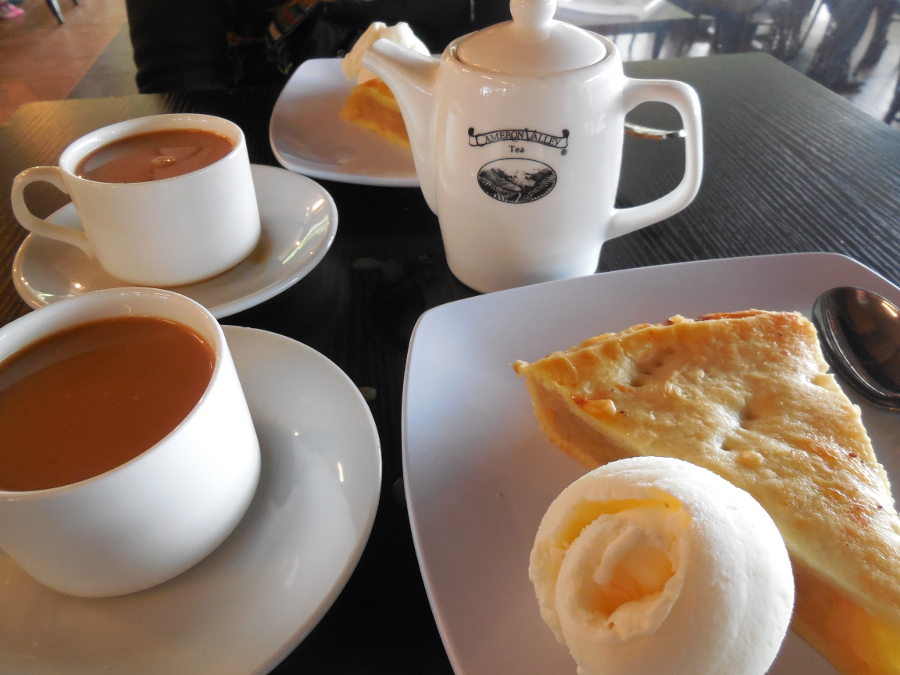

<b>Our fresh tea and apple pie</b>

##### Ipoh
Ipoh was a funny little city. For being quite large and having a close proximity to other popular places in Malaysia, we felt like we were the only foreigners in the entire city. It was perfect though, there is so much more culture in a place that has not felt the grasp of tourism. We stayed here for about 5 days and really enjoyed it. To be fair, there really wasn't much to do but to explore but, in a place like this, that was enough. On our first day, we weren't able to check in for a while after arriving so we went for a wander around. I heard the familiar sound of a sports whistle and made Liv come with me to investigate. We walked through a small alleyway and sure enough it opened up into a large park with 3 soccer fields and a local Malaysian tournament going on. We grabbed some food and coffee from a nearby place and sat for a while to watch. It was pretty low-tier but very entertaining to watch (at least I thought so). We did little else worth writing about though, it was mostly just a nice experience to live amongst the locals and see what life is like in a city with little to no tourism.

##### Penang
Penang is a historic city full of art and culture. We came here for 2 main reasons, one was because of its popularity and reputation for its art and culture and the other was to meet up with and hang out with a Swiss friend named Nicola that we met back in KL (remember when I said I would mention them later?) who was working in Penang. We stayed in the heart of everything in the Georgetown region so we could be walking distance to everything. Having just suffered one of the worst floods of its time, many big attractions were closed so we did miss out on a few things. We did stil do some really neat stuff though. We went to a weird place that was half museum (see I said we would go to more) and half trick art gallery. The history of Penang and its colonization is really quite interesting, but I won't bore you with that here. We also went to Cheong Fatt Ze's Blue Mansion. Yet another fascinating tale, in short, he was a poor Chinese child transformed into a very successful business man and was hugely influential to the region. He had built a beautiful mansion in Georgetown which is a bright iconic blue in color. The rest of the history you can look up for yourself if you wish. We spent a bunch of time hanging out with our friend Nicola and his co-workers and also bought a proper camera here! We were growing a little frustrated with not being able to capture the beauty of these areas that we were seeing so we figured if there is ever a time to invest in a proper camera, it would be now. We spent our last day in this Penang exploring the vast amounts of street art in the alleyways and testing it out.

<b>The iconic kids riding bicycle street art</b>

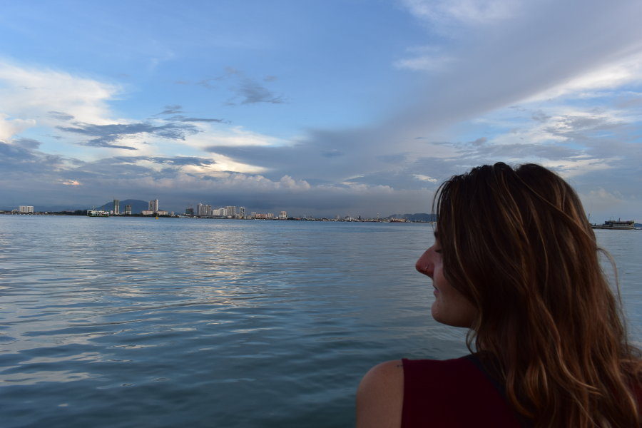

<b>Taking a breather at the Chew Jetty</b>

##### Langkawi
Langkawi is amazing! And I would have to say that it was my favorite place in Malaysia. We were brought back to the beaches and island life here and were more than ready to just kick back for a little bit. We ended up staying here for a little over 2 weeks and loved every minute. This will probably be the most photo-rich section of this post. I'm also going to have to split it up into a list again like I did for KL.

So here we go, cool things we did in Langkawi:

1. ##### T-Star Garden
* When we first arrived, we got ourselves booked into a place called the T-Star Garden. It was dirt cheap and we would be living in a bed in a tent. It was so cool that we extended our stay... for a few too many days. The tents were all in a netted off area with plenty of plants and green to separate them and in the center was an area for the birds, which were allowed to fly around the entire area freely. The birds were so funny too, if you still had sand on your feet from spending some time at the nearby beach, they would swarm you and pick at it. We enjoyed the first 3 nights so much here that we booked 3 more, problem is that it only had fans so you had no chance to escape the heat and you had to shower from a hose in and outhouse. I know what you're thinking, "if you didn't like that why would you book again?" and the answer is that those things didn't really bother us that much. What did was that I got a real bad cold the day after we extended and if you've ever had a bad cold in an unbearably hot and uncomfortable place, you know it is not a good time. We ended up spending an entire day just sitting around in a coffee shop with AC drinking way too many coffees just so we could be out of the heat. All in all, it was a great place though and we really enjoyed it.

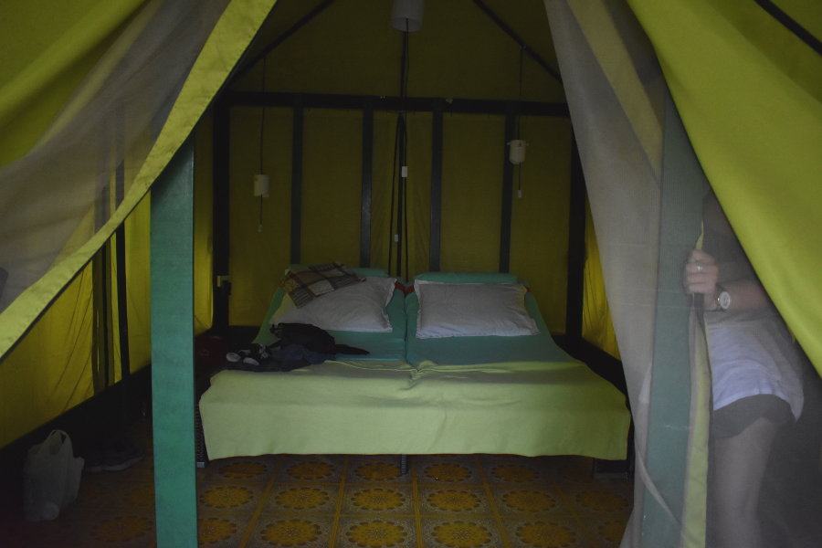

<b>Our Tent for several nights</b>

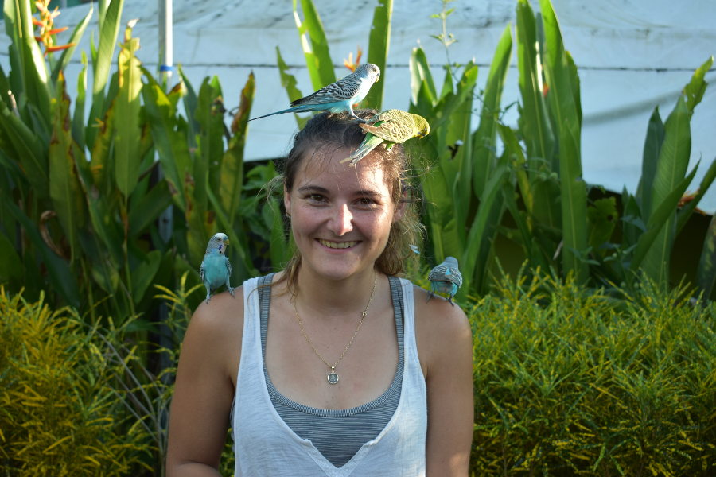

<b>The goofy birds</b>

2. ##### Underwater World
* On our first full day in Langkawi, I surprised Liv with a visit to the Langkawi Underwater World. It's a huge aquarium and we spent a good 3.5 hours in there. We were a little disappointed in the main draw of the the place though. I decided that it would make a great surprise because we had just been talking about how neither of us have ever gotten to see one of those aquariums where you walk through a tube with fish swimming all around you. Their website showed just that, complete with small sharks. What we got however, was an underwater tube with very dirty glass and no fish whatsoever. The rest of the aquarium was spot on though and we had a great time regardless.

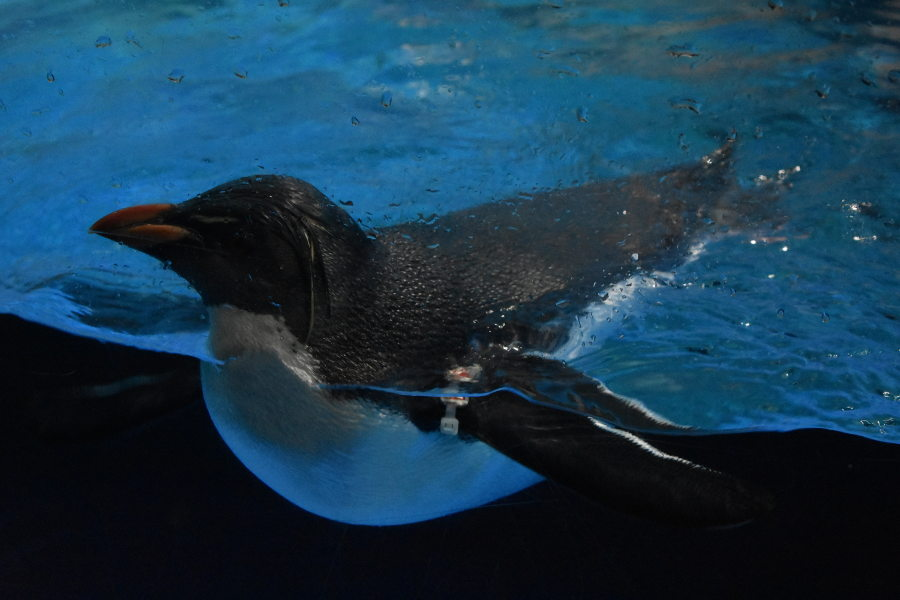

<b>Just a happy penguin!</b>

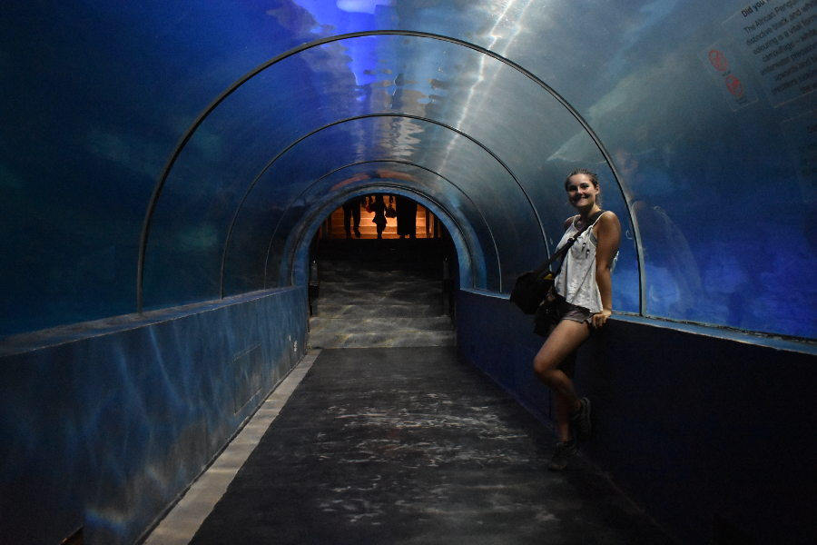

<b>Liv's aquarium tube</b>

3. ##### Nest Rooftop
* After the Underwater World, we sat outside wondering what to do for a while, since we had no intention of returning to our tent in the midst of the hottest hours of the day. As luck would have it, I came across what came to be our favorite place on the island. The Nest Rooftop is a strange but awesome place! It is a bar on the roof of an apartment building with 360 degree views of the beach and that area of the island and was prime location for watching the sunset. The icing on the top of the cake, and also what made it so strange, was that it had no liquor license. Again I know what you're thinking, "what kind of bar could it be without a liquor license?" and to that I say the best kind! How it works, is that they are not allowed to sell liquor but you are encouraged to bring your own. And with Langkawi being a tax/duty free island, liquor is dirt cheap. For example, when we first found out about the place, we grabbed a litre of flavored vodka for less than $5CAD and took that. We bought soda for mixing from them and watched the sunset, while having as many drinks as we wanted for less than $8 for both of us. Needless to say it was a great time and became our go-to sunset spot and we got to know the people who ran it pretty well.

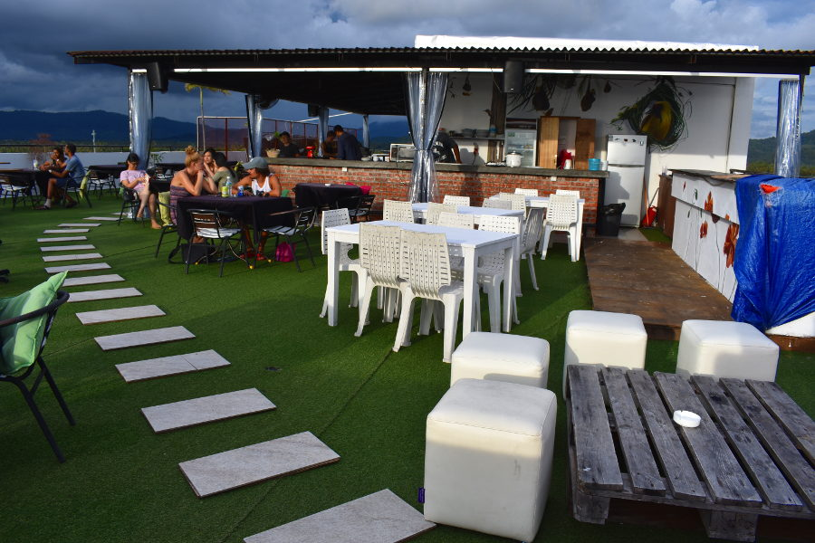

<b>A view of the rooftop</b>

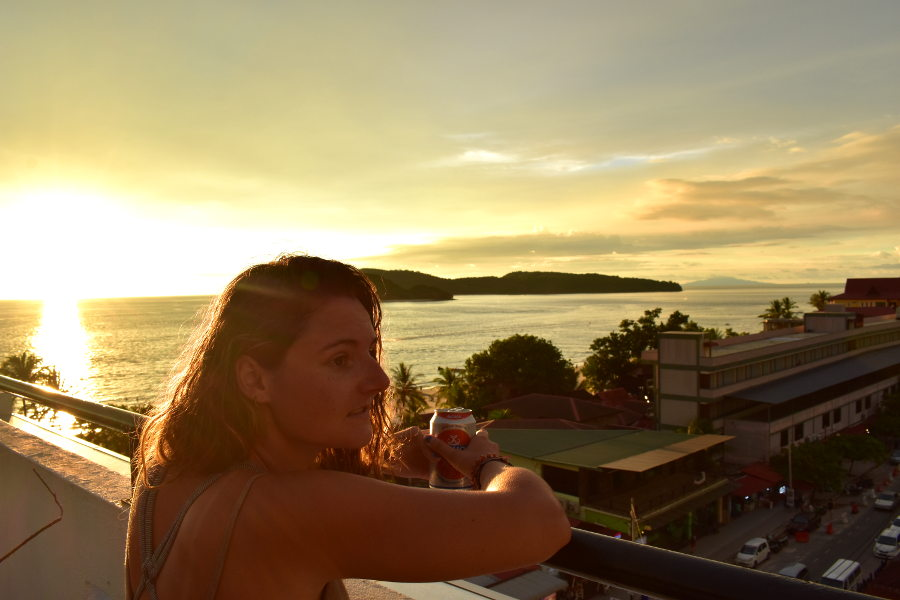

<b>The view from the rooftop</b>

4. ##### Legenda Park & Eagle Square
* These 2 are very popular tourist attractions and once again, were really nice to go and see but were ultimately underwhelming. Legenda Park is a beautiful park to go and wander around in and look at all the statues and art but that's about it. Grab a coffee and your camera in the morning and go for a stroll and you'll have a nice time for a few hours. Eagle Square isn't much more than a massive eagle statue near the main jetty terminal for the island. It's cool to see and snap some photos of but there isn't really anything to do there.

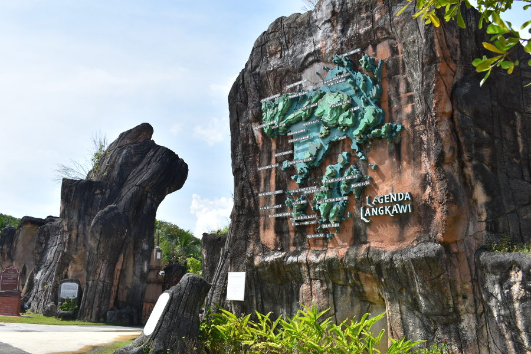

<b>Legenda Park entrance</b>

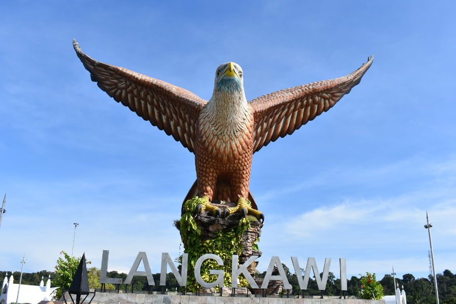

<b>The big eagle at Eagle Square</b>

5. ##### Moh
* Oh, where to start with Moh. What a goofy character! We moved into a dorm we found on AirBNB run by Moh because it promised free scooter rentals with your stay. I have to say, this was the best decision we made in Langkawi. First, because Langkawi is best explored by bike when you're free to go wherever you please. Second, because we made friends with a nice German couple named Niklas and Charly who we went on to travel with for another 2 weeks through Thailand. And third, because we got to meet Moh. He is a motorcycle fanatic and is probably the most outspoken and sociable man I've ever met. We had nice little chats about motorcycles and he would get so excited at the chance to talk about riding. He also took us on what turned out to be the most memorable and most "real" trip we have been on in our travels so far, and probably still will be when it's all over. We went for a cycling and island-hopping tour to the small island of Pulau Tuba. We started by riding our bikes to the locals jetty which has a bunch of flimsy fibreglass speedboats that cost almost nothing to ride but only locals know about it. We chucked our bikes on the boat and headed to the island. For the most part, we just rode around the small island and observed how the local people lived. Keep in mind that there are no other foreigners and no visitors to this island, the only people around are the ones that call this island home. At one point, we stopped for a swim. During that time, Moh got some locals to collect coconuts for us. We had more fresh coconuts than we could handle and we paid 1RM each for them, as opposed to 6-15RM anywhere on Langkawi. Then, just before we left, a small fishing boat came in and we bought a whole bunch of freshly caught fish from them. Moh organized with some local ladies to cook us a big lunch of curried fish, rice, soup, and a salad made from herbs and plants that they hand gathered from  the forest. It became a whole thing, because we were the only foreigners these people have seen in a long time, if ever for some, people were very interested in us. I guess also on these small islands, when something starts happening, people accumulate and are like one big family. Everyone is welcome everywhere and wherever they see a bunch of people accumulating they know that that is the place to go. We had a wonderful lunch and had a real interesting time trying to figure out how much to pay them. In the end we left it up to Moh, and we paid far less than we would for a meal like that anywhere else but also way more than the people there were used to so they were ecstatic. This was a great insight to how people live from different walks of life and it is difficult to put into words the way it changed our views on what a person really needs to be happy.

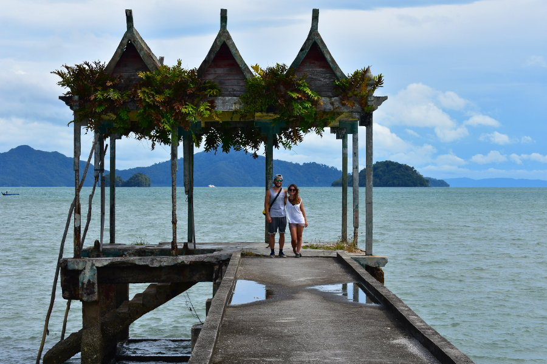

<b>A little structure at the end of the long dock on Pulau Tuba</b>

6. ##### Langkawi Skybridge
* This place was awesome and during our outing we had yet another Moh-induced memorable time! The Langkawi Skybridge is _the_ big attraction of Langkawi. It is essentially a cable car system that takes you on a scary climb all the way to the peak of one mountain, where you get off and can buy souveneirs or have lunch. Then you get on yet another cable car which takes you across to yet another peak where the same applies. From there though, you can get onto the Skybridge which is just one long curved suspension bridge that connectes that mountain peak to a third peak. It was so cool to be so high up on this thing and being able to look around and see the entire island and the ocean stretch off into the distance on all sides. The bridge itself swayed a little bit and was a bit sketchy but nothing too bad. Then there were the glass floor panels that you could stand on. That was quite sketchy! To stand on the panel looking all the way down to the forest below was a little unsettling but very cool. Following that, we started to make the ride home, and this is where the story gets interesting. Riding through the bends and the mountains, I started to notice the bike's steering getting quite wobbly and I knew something was up. Luckily, we made it out from the mountains and onto flat land where I pulled off and checked, and sure enough, we had an almost completely flat front tire. Unluckily, nobody around spoke English and even though there was a scooter repair shop in sight and I waved the owner down as he passed, he said his shop was closed and there was nothing he could do. I did manage to get him on the phone with Moh with my last few minutes on my phone card to give him directions for where we were at and he left. Moh claimed he'd only be 15 minutes so we sat and waited... for an hour and a half. By this point it had gotten dark and we had no idea if he was going to show up and we'd have to abandon the bike and try to walk, but we stuck it out and he did eventually show up... with a bike pump. We pumped the tire up and started the journey home, stopping about every 10 minutes to repump it as it kept going flat. Then at one point he stops us and says, "you wanna go on an adventcha?!" to which we promptly replied, "Of course!" I mean it's not like our tire is flat right? So this was a bad idea from the start but the adventure was actually pretty cool and we went through some small narrow back roads with no light and just the sounds of our bikes and jungle noise and came to a bridge that was submerged with water. Naturally, we put our feet up near the handelbars and rode right through it. On the last stretch (and thank god it was the last stretch) we got caught in an absolute monster of a downpour. Like flash flood downpour! It was so bad that I couldn't keep my eyes open with the rain and at one point I narrowly avoided giving us a pretty nasty crash. We rode the last bit with our feet up by the handlebars and chilled right to the bone. Never have I been so relieved to arrive safely to the hostel and have a nice hot shower.

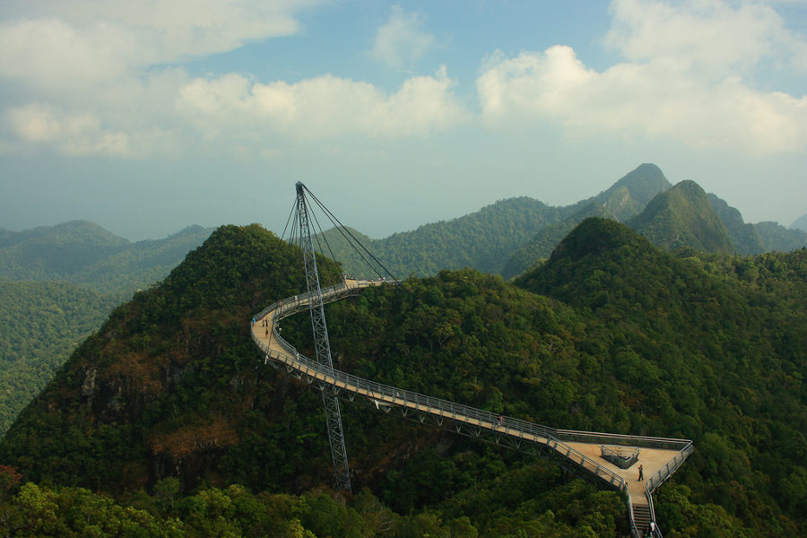

<b>Langkawi Skybridge (photo cred: justgola.com)</b>
 
7. ##### Waterfalls and Beach day
* For our last day in Langkawi before we and the German couple headed off for Thailand, we decided to have an island touring, waterfall exploring, and beach chilling day. We pretty much covered the whole island this day and it made for a perfect last day. We went to 2 of the main waterfalls of the island and 3 of the main beaches. When we finally settled on a beach to stop and relax on it was beautiful! Nice white, sandy beach and plenty of nearby islands to break up the endless ocean view. Niklas and I also noticed what looked from a distance like a photo shoot and went to investigate. Turns out they were filming for a Russian surfing film and we tried to get into it in the background. It didn't work out but we ended up making friends and chatting with a Malaysian Army guard for a good while before returning to swim with the girls.

##### Koh Muk
During our time travelling back up through Thailand towards Bangkok with Niklas and Charly, the weather ended up being pretty bad and we didn't end up doing as many exciting things as we had wanted. But the one really cool place we went was Koh Muk. It is just a tiny island in the South of Thailand and you can walk from one end to the other in about 30 minutes. For the most part, there isn't much to do here except relax on the beach, some snorkeling, eating, and drinking at the little beach bars. But there was one thing we did that really made the whole trip here worthwhile (and we almost didn't go through with it). This was our kayak trip to the Emerald Cave. Typically people do this as a tour and that would have been the sane thing to do, but we didn't want to do that. Instead, with a severe lack of planning and knowledge of what we were getting into, we rented a kayak and set off to do it ourselves. All we knew was to go at low tide, take a headlamp, and always stay to the right. The rationale for these was that the entranceway to the Emerald Cave is really just a small whole in the limestone cliff that makes up the edge of the island. You paddle directly into that and it is scary as hell. And then, it gets pitch black, like the Dark Cave mentioned earlier, and without a headlamp you are screwed. You have to go at low-tide with a kayak, and return while it is still low-tide because otherwise you will not fit through the cave. And as it turns out, always stay to the right is wrong. We did that and hit a terrifying dead-end and had to back-paddle our way out. That was fake-news. The real info was that once you get in and around the big overhang at the start, then you stay to the right. At this point, you can't see anything except the small amount of light from our Fisher-Price headlamp and can't hear anything over the deafening sounds of the waves crashing around in the cave. And yes... it's scary as hell. Just as we all had a moment of "holy shit I'm done let's turn around and get the hell out of here", we saw just a small sliver of light. We headed towards it frantically and sure enough, it was the cave mouth as it opened up to probably the most beautiful scene I have ever experienced in my life. It was something straight out of some kind of pirate paradise film. The water glowed with an Emerald hue as we beached the kayaks on our own private paradise. There was the small bit of ocean, a tiny beach and palm trees right to the back wall. I say back wall because it is like someone just cut a big cylinder out of the giant limestone cliffs that surround you on all sides. And that was it, the cave entrance was the only way in, and the only way out. We had us a nice relaxing swim and basked in the glory of having survived before we got too scared that we wouldn't make it out with the kayak and had to leave. Imagine not getting out in time, and having to wait until the next low-tide. But we did make it out on time, just as a tour was coming through. 20 or so people swimming in with bright orange life-vests. Kinda ruins the scene and none of them will feel the paradise discovery feeling that we did. Thank God we didn't do a tour.

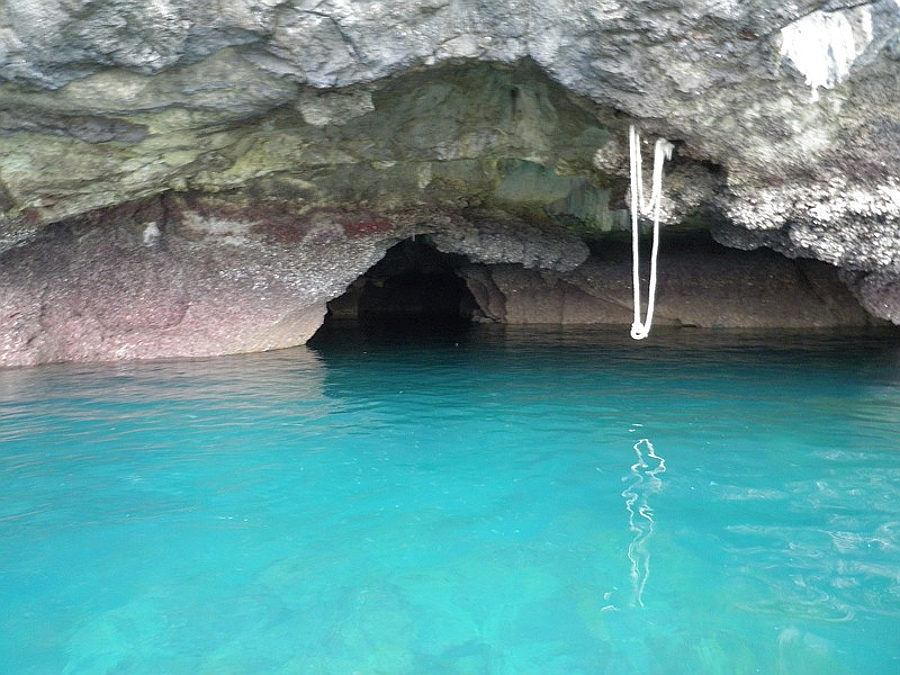

<b>Entrance to the Emerald Cave (photo cred: blog.mailasail.com)</b>
 
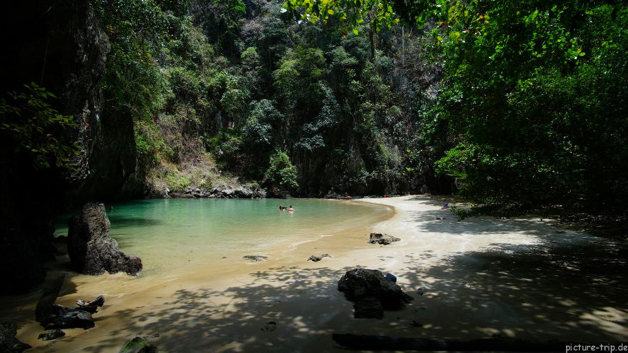

<b>Emerald Cave Beach (photo cred: picture-trip.de)</b>
 
##### Bangkok (Again)
We eventually made it back to Bangkok, where we stayed for a while before saying farewell to Niklas and Charly and heading off to Vietnam. You've all already heard me ramble on enough about Bangkok in earlier posts so I'll give you the CliffNotes version. Bangkok the second time around is a whole different experience than those first moments of "well, we're here, now what?" that we had our first time and was actually a lot of fun the second time through. I'm not sure if it was so much that we already knew our way around this time or if it was just we have become very accustomed to all the things that were unsettling before but we were significantly more comfortable here this time around. Having missed it the first time around, we visited the Jim Thompson house this time and it was really cool. In short, Jim Thompson was an American army officer stationed in Thailand for a while. When his service was over, he moved back to Thailand and was credited with revitalizing the Thai Silk industry. He became very wealthy and built this house using woods from all different regions of Southeast Asia. As the legend goes, he went on an expedition into the Cameron Highlands (where we visited, discussed above) and disappeared without a trace. Nobody knows what really happened to him. But the house still stands and is a great work of art. Nobody is allowed to take any photos of the interior of the house so unfortunately I cannot show you what it looked like inside. Other than that, we didn't do much worth mentioning this time through and I'll save you from having to read any more.

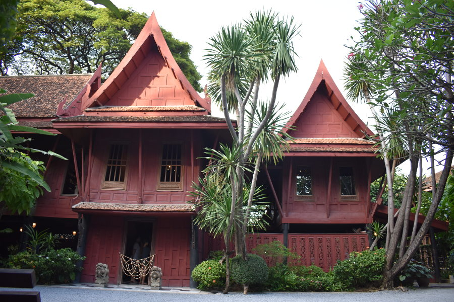

<b>Exterior of Jim Thompson House</b>
 

#### Outro
Well there you have it everyone, I'm all caught up (mostly, there's still Vietnam after all). I told you it would be long! I warned you. But congrats for sticking with it and I must say I'm impressed that you got this far! I hope that you enjoyed reading it and as usual, feel free to message us if you want to hear more about any of our strange excursions, or test out my nifty new commenting system below,  and don't be afraid to share this post with friends!

Thanks again for taking the time to read my (somewhat coherent) ramblings!

[plugin:youtube](https://youtu.be/ABucP9--AiM)

<b>Liv's Recap Video (Her best one yet in my opinion!) Let us know what you think!</b>
 