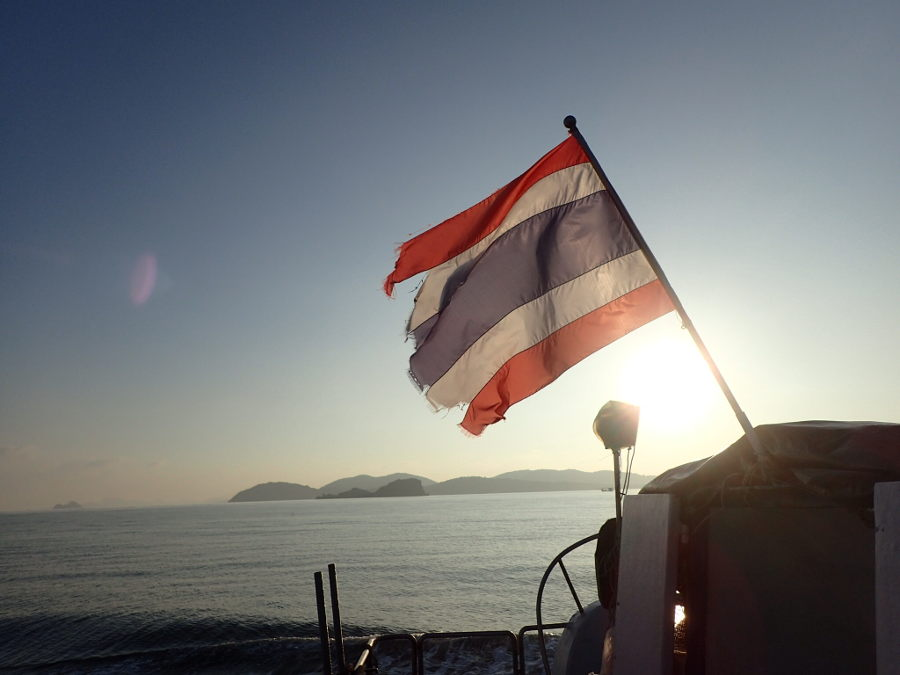

Before we get in to the juicy details about Thailand, here is some real talk. Visas and money. Jon and I pre-applied and received a three month visa for Thailand while we were still at home. Even though we were approved, when we entered the Kingdom of Thailand we were still only given SIXTY days… something we didn't notice until sometime after entering the country. So check your entry stamps people! We had to get a visa extension in order to stay the full three months. You can do this at an immigration office in Bangkok or Chiang Mai. There may be additional offices but those are the two I know of for sure. We chose Chiang Mai Immigration Office located at the Promenada Mall and let me tell you, the immigration officers are sticklers so make sure you have all the proper documentation and have the forms filled out before you reach the desk. The 30 day extension for a tourist visa (you can only apply for this once in a 90 day period before you have to leave the country) cost 1900 baht which was roughly $75 CAD. You'll need to bring the following documents:
-Passport with a valid Thai tourist visa (to confirm authenticity)
-Photocopies of the main passport photo page, current Thai tourist visa page, TM.6 departure card, and latest entry stamp (you can also find a kiosk where you can make copies)
-Application for Extension of Temporary Stay in the Kingdom (form TM.7)
-One 4cm x 6cm passport photo (you can have these taken at another kiosk)
-The address where you are temporarily staying in the Kingdom (hostel and hotel addresses are accepted)

Next is money. There were some ATMs around Thailand that only accept credit cards. And I strongly, strongly discourage taking cash out on credit because you're charged a significant fee. Look for ATMs with the cirrus symbol that should be on your debit card. We tended to stick with the yellow “krungsri” ATMs. A little tip, we were charged approximately 200 baht per withdrawal which is roughly 8$ CAD and your bank will most likely charge a conversion fee as well. These ATMs also dispense cash first and then the card second, I definitely lost my debit card this way so just remember to wait for it. Don't forget to notify your bank of your intended travel dates and I suggest increasing your daily withdrawal limit so you can minimize ATM transactions and fees. Along with ATMs, there are plenty of exchanges around, just be sure that you're not being “accidentally” ripped off by the people working the counter. 

On to the good stuff! Thailand is a pretty large country so if you're trying to decide on where to go I suggest thinking about the amount of time you have. We've been asked what our favorite places were and it's a hard question to answer. The north and the south are vastly different and both are so worth visiting. We had a short stay in Bangkok and then hopped the night train to Chiang Mai. I really enjoyed the city and there was tons to do. From the temples to the elephant sanctuaries, cooking classes, national parks, the Grand Canyon of Chiang Mai and the list goes on. Be careful if you decide to rent a scooter here because you're technically supposed to have an international bike license and there were police check stops ALL over. They stop you and fine you a large sum but I just kept 300 baht in my wallet and hid more in my bag to avoid paying more. After the fine I could not be fined again for three days so it's like a temporary license… It's essentially a huge money grab but scootering is a blast so I still recommend exploring the old city this way. The drive on the scooter to Doi Suthep was a highlight for me. If you're not a fan of the two wheeled life then you can always hop in a red canopied taxi truck for 20 or so baht and they take you anywhere in the old city… We had 25 people in/on one on a certain night out!

Next came Pai. Three days turned into eleven so that should tell you how awesome this place was. Most would saw its a super chill, hippy-vibe kinda place but not too hippie where people don't shave their pits if you get my drift. I loved it here. It's a threeish hour van ride from Chiang Mai and if you get motion sickness at all this might be the time to make friends with Gravol. I don't suggest scootering from Chiang Mai as there is a military check stop just before Pai. We pretty much spent our days scootering to the beautiful destinations that make up Pai. The small hippy-ville has its own canyon which is well worth checking out for a good hike or even just an Insta photo. There are quite a few waterfalls around Pai, some hot springs, hiking trails and even a China Town with the most gorgeous view point AND they serve you tea all for just 20 baht! You won't regret visiting here. 

After Pai we flew south to Surat Thani. The flights were a decent price and it helped us save a lot of time rather than taking a bus or train. We immediately left Surat Thani for Koh Sok National Park where there is a beautiful man-made lake. We stayed in floating bungalows for the night and enjoyed the crystal clear water. This was a bit of a pricier stay but it's a worthy bucket list item. Next we bussed it to Krabi. Just a heads up the buses almost always take longer than what you're told. There's really not much to do in Krabi town other than party so we spent our time exploring the surrounding areas. I found Ao Nang a bit better for the average backpacker.

Drumroll for this next place… Railay freaking Beach aka paradise. This one is a gem and we really lucked out here. In peak season staying on Railay Beach can cost you big bucks however, we swept in when the weather was just getting perfect and it was nearing the end of October. You can only get to Railay by boat. It's a ten minute ride from Ao Nang or a 45 minute ride from Krabi town. The limestone cliffs surrounding the beach make for a killer view from the west beach and there's so much to explore here! Kayaking, paddle boarding, rock climbing, trekking to the look out or the lagoon, island hopping etc, etc. 

The ferries to and from the islands are generally cheap and easy to navigate. We explored Phuket, Koh Phi Phi and Koh Lanta on the western side and moved onto Koh Samui, Koh Phangan and last but not least Koh Tao on the east. Koh Tao is a great place to get your certification for diving as its one of the cheapest places in the world. Jon and I went with Big Blue, it's a larger company and I was really impressed with the course. Every licensed diving company around the world has to meet certain criteria and Thailand is no exception. 

Since Thailand has been a tourist destination for 15+ years traveling throughout the gorgeous country is quite easy. The transportation is not always glamorous but there are many bus companies, trains and airports throughout the Kingdom. There are plenty of ATMs and money exchanges, loads of affordable accommodation and of course there's 7/11s EVERYWHERE (be sure to try a toastie, you won't regret it). So get ready for a lot of pad thai, fried rice and delicious curries and be a little adventurous with the street food!

