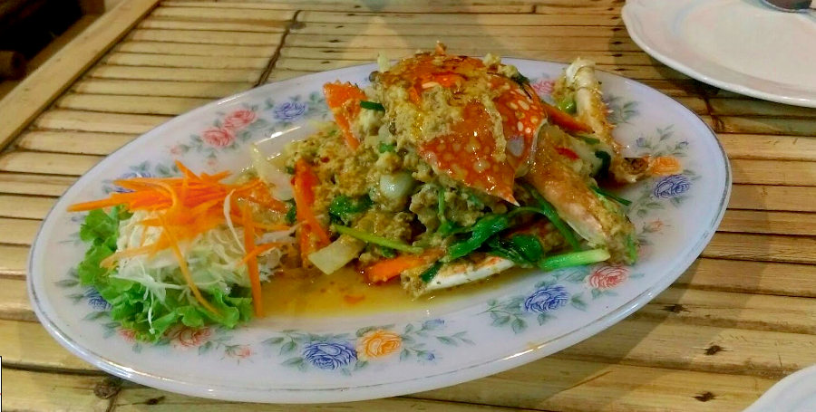
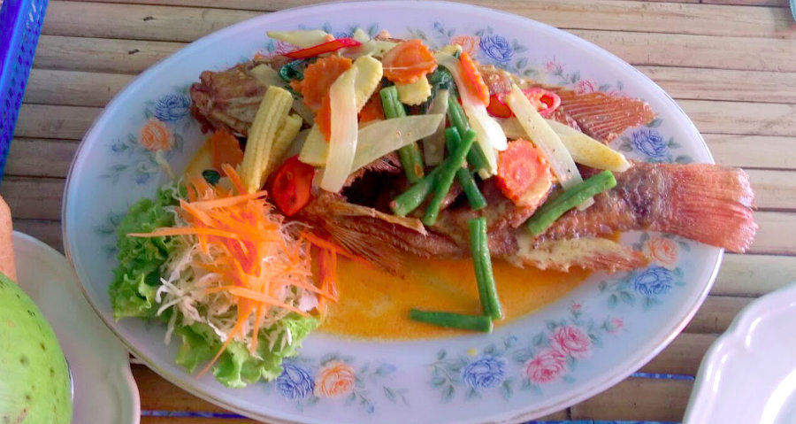
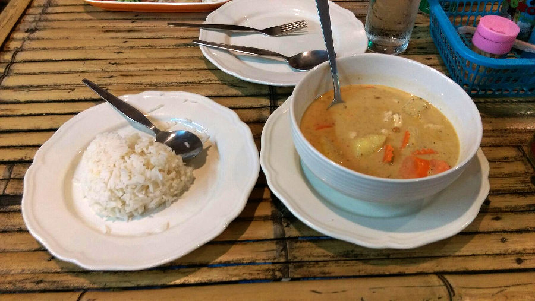
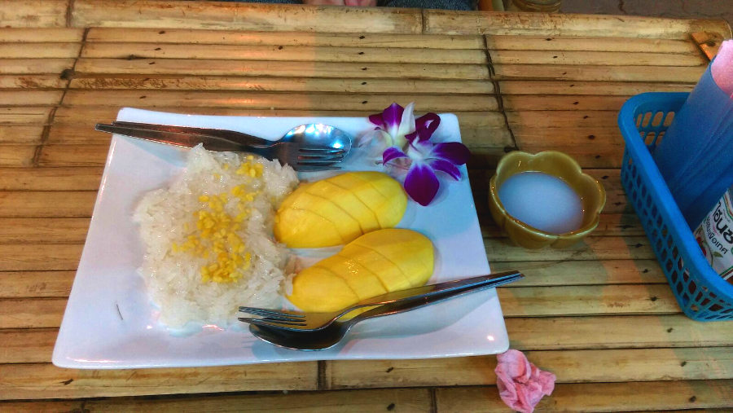

#### Original Thai Food
**Disclaimer:** I am in no way profiting from this review, I am just a blown-away customer doing what I can to reciprocate.

By the unfortunate circumstance of credit card fraud and an unreasonable screwaround with my credit card company (which still has not been resolved 1.5 months later), we found ourselves staying in the Ao Nang Beach area of Krabi for 2 weeks. It only took 1 day however, to realize that there are enough food options here to try a new restaurant everyday for probably a few months. I'm not kidding, it's quite remarkable! This is why I was caught a bit by surprise to find that I found a place so good that I eventually ended my search for the best restaurant in Ao Nang, rather early on.

It all started with us, credit card issues and all, searching for the cheapest possible place to get a filling meal. After looking around for a while we found this cute little restaurant called Original Thai Food that just sort of blended into the rest, all except for the bright orange sign reading Pad Thai with Chicken 50 baht. After talking to the sweet lady there and trying my first of many meals there, I was sold. For the Canadians out there, 50 baht is a little less than $2, so what you might pay for a bottled water in Canada is a full-fledged and delicious meal here.

For a while, we felt guilty about not exploring the abundant food options out there in this area and proceeded to test out a few other places that had gotten good reviews but at each one they just couldn't compare to the prices and quality of the meals at Original Thai Food. We eventually more or less gave up on the search for anything better, realizing that the chances were slim. We became regulars at this little place and started to explore the other options on the menu. We can honestly say there was not one item that we tried that we weren't impressed by. And the most we paid for a meal, even fancy seafood ones was ~$8CAD.

<b>Curried Crab</b>

<b>Grilled Fish</b>

My absolute favorite meal though, and I believe the best thing I have ever gotten from any restaurant was their Massaman Curry. It is a nice large bowl of curry, chicken and potatoes with vegetables and peanuts thrown in. Add some rice to it to soak some of it up and it is mindblowing. This thing now haunts me in my travels!

<b>My Favorite: Massaman Curry!</b>

This is one of those restaurants that is easy to pass by for a few reasons:
* There are so many restaurants along the strip with bigger and flashier signs
* The owners of the other restaurants come out on the sidewalk and hassle you to eat, it gets very frustrating and is very refreshing that the owners here don't do that
* They weren't on Google Maps (until I came along)
* They didn't have a website (also until I came along) you can view it **[here.](http://www.timbakerdev.com/originalthaifood.github.io?target=_blank)**  (Still a work in progress)

This is a real shame knowing that people could spend chunks of their vacation here and not get the chance to experience it.

The food is unreal here and I could go on for hours about it but the real hit here is the owners. It is a small family run place and they are just the sweetest people I've ever had the pleasure of meeting. After a few times in, I ordered take-away Pad Thai and the lady "gave me a little extra" with a smile. It was practically a triple sized one and was actually heavy to carry. From then on, every so often she would just give us some extras at random at no extra cost, like a take-away order of fruit, or an extra snack. I've never experienced service and kindness like this before and felt I had to reciprocate in some way.

<b>One of our surprise "extras": Mango and Sticky Rice!</b>

I noticed that they weren't getting a lot of business and also that they weren't on Google Maps, or had any type of online presence for that matter. This is common in these areas but the ones that do do very well with the masses of tourists using the internet exclusively for where to go. After discussing with them, through a thick language barrier, they agreed to let me take care of getting them online and were very thankful! They are now on Google Maps and getting quite a lot of exposure and I am currently working on a website as a surprise gift to them. Again, it can be viewed **[here,](http://www.timbakerdev.com/originalthaifood.github.io?target=_blank)** and any feedback on it would be appreciated. I can't say whether it was coincidence or if the Maps had a real impact but for most of the time that we were there they had few customers but by our last night there they were so busy that we barely had a chance to say goodbye :)

On our last night in the area we went for dinner with a little gift for them (I won't say what it was :) ) which was good because they also had a surprise for us. They had prepared for us a special dinner which isn't on the menu and said that it was on the house! We couldn't believe the generosity, as they brought more food and deserts. This was the kind of meal that you would have to reserve long in advance for and would come with a hefty bill. This is by far the best we have ever been treated by a restaurant and they really made us feel like family. We are now friends on Facebook and still chat as much as we can through the language barrier (thank you Google Translate).

There are times when you meet people and just can't help but think that they just deserve so much more, this is one of those cases. For people this great, I really wish that I had the means to do more to repay them for their kindness and generosity. But as of now, I'm stretching my dollars while travelling, but will do what I can with the skills I have.

> If you would like to help out, their Google Maps page is **[here,](https://www.google.com.my/maps/place/Original+Thai+Food/@8.0349546,98.8280709,17z/data=!4m5!3m4!1s0x3051c006c9268571:0xd4567fbfc4009890!8m2!3d8.0349493!4d98.8302649?hl=en?target=_blank)** and if I have done a good enough job to persuade you, **please give them a 5 star rating**. You don't have to write a review, as you may not have been there but ratings are good too.

If you are ever travelling through this area, this was certainly one of the highlights of our trip so don't miss your chance to try my self-proclaimed "Best Restaurant in Ao Nang"... Original Thai Food!