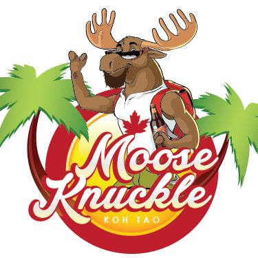
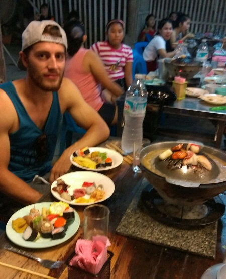
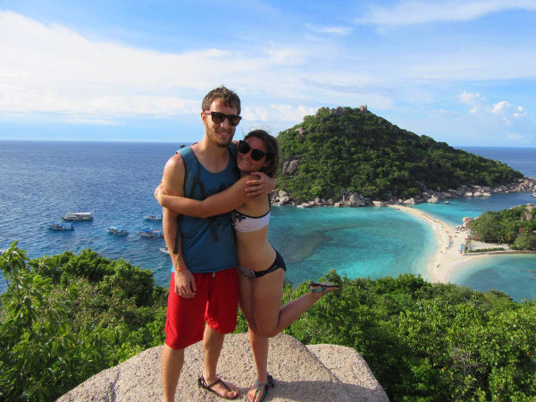

Oh Koh Tao. What a great place! I think it's been my favourite place so far. We actually did quite a lot in the short time we were there and it's hard to know where to begin. I guess I'll start with my favorite subject...FOOD! Everytime we move to a new place I make a list of things we want to do there before we move again. Half of my list always ends up consisting of food joints we have to try out. The Thai food is amazing here, but there is only so many times in a month you can eat rice, noodles and curry for breakfast lunch and supper. That's why we were super excited to discover a restaurant called Moose Knuckle. It's run by a Canadian couple and they had poutine! Glorious poutine. It's a first for us in Thailand and was a welcome change to our usual diet. The couple is incredibly nice too and are definitely worth meeting if you find yourself on Koh Tao. We had just intended on grabbing a quick to-go poutine to try it out at the end of a night out (perfect "way home from the bar" eats) but ended staying around and chatting with them for about an hour and a half. 

<b>Heaven for travelling Canadians</b>
 

When we were ready to eat Thai food again, we discovered a super cheap all you can eat BBQ buffet for 169 baht per person (~$6 CAD). It was really cool because you got your own mini BBQ and they had a long table of different meat you could load up on and barbeque yourself. None of the meats had labels so you really just had to hope for the best that you didn't end up eating chicken liver and chicken hearts on accident. At least I think that's what those things were. Nevertheless everything we did choose to try tasted good. While you were waiting for your meat to cook there was also another table of already cooked items that you could munch on. Including sushi! Tim decided it was a good idea to have a big bowl of curry and rice. Big mistake. It was painfully spicy. I was too scared to even try a bite. The rules of the buffet stated that you had to pay an additional 20 baht for every 100 grams (or something like that) of food you didn't finish, and he did not want to pay extra so he forced it down, but he definitely suffered for awhile after. I think I would have taken the extra hit to my wallet myself.

<b>Unfortunately, the best photo we have of this wonderful place. You wouldn't know it, but Tim was actually very happy there ;) </b>
 

Another really cool thing we did on Koh Tao was take a snorkeling tour. One day we were shopping in a little store and Tim found a shirt and a pair of shorts he wanted. He asked the owner lady how much they cost and haggled a little with her, as is expected in Thailand. In the end he gave her a little more than they eventually settled on because she was really nice. Just as we were about to leave the store she asked if we were planning on going snorkelling, which we were. Lucky for us she also ran a little tour shop called Scuba Club and she could get us a discount. The normal tour usually costs 600 baht a person, but she offered it to us for 300 baht each, so half price! We were a little skeptical when we handed her the money because she just wrote her number, name and date on a little notebook paper, ripped it out gave it to us and said someone will be at your guesthouse in the morning to pick you up...okkaaayy. Lucky for us someone did come pick us up and the whole thing went off without a hitch! We even went back to her to thank her and book our tickets to Ao Nang Beach and she saved us another 800 baht on those! Morals of that story, it pays to be kind and not everyone in Thailand is trying to scam you as many are made to believe. We met some cool girls in the truck that picked us up who happened to also have just finished up at UVIC. Tim even lived in the same residence building as one of them in his first year there. Small world! They were also doing the tour and together we got to go to four different beautiful locations for snorkeling. A buffet lunch was included. Unfortunetly I got incredibly seasick and spent most of my day sitting on the edge of the boat trying not to throw up. Thankfully, at the last island we went to, we got to stay on it for about and hour and a half. We spent that time walking up to an amazing viewpoint which finally cured my seasickness.

<b>The perfect view to end a great day!</b>
 

[plugin:youtube](https://www.youtube.com/watch?v=WQsjNbBVOWU)

<b>We also decided to try our hand at some more GoPro video throughout the day, and here's what we got!
</b>
 

There was tons of other small things we did during our stay including minigolf, beerpong, many more delicious restaruants and visiting baby sea turtles, but for those things, you will just have to come and experience them for yourselves ;)  