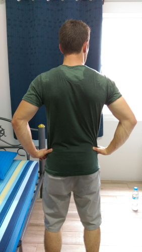

#### _First time foreigner_
So here it is, our blog begins a few days into our journey. Admittedly, we have been feeling a bit guilty for not taking the time to write this a few days ago when we first arrived (or in the time since) to let those back home in Canada know how we are doing. But we have realized that this is probably a good thing for a few reasons. First off, we have been a bit overwhelmed by it all and haven't really had a chance to stop and take a breath. Life moves fast here and it's quite hectic when you have no idea how to keep up with it all. And secondly, our first impression of the place has somewhat subsided in the few days since arrival.
#### First Day
From the moment we stepped through the immigration gates and grabbed our bags, our whole world shifted. Things that were second nature back home in Canada were now seemingly impossible, and things that we would never consider doing back home were a way of life here. Thailand is pretty good with having English written on directions but without knowing any Thai on arrival, the simplest things like looking at a map or choosing a phone plan become very difficult. And who in Canada would consider buying incredibly cheap food from a guy with a cart parked under an overpass? (Highly recommend doing it here, not so much in Canada). After finally finding the Rail Link into the city (hint: it's down a few escalators from the airport lobby) we took a ride that gave us our first glimpse into the Bangkok lifestyle. The first thing we noticed was the complete intertwine of different classes in Thailand. There seems to be no divide in area of the wealthy or the poor. One building will be meticulously crafted, yet surrounded by derelict apartments that one couldn't imagine anyone living in. This trend continues all throughout the areas of Bangkok that we have seen.

The city seems to be dirty, cramped, and downright insane; but at the same time, a beautiful blend of freedom and religion, and bursting with culture. For a first-time foreigner such as myself, the experience thus far has been as exciting as it is terrifying.
#### As days go by
By the second day, we have already become far more accustomed to the way of life here. My first indication came when I realized that at a busy, uncontrolled street, we crossed right through in front of traffic, just as the locals do. The previous day, this same intersection had us held up for 15 minutes in confusion of how to cross. We had the Sky Train figured out and bought food from street vendors and went about our day without much of a hassle. Except for the sweltering humid heat, that is.

<b>Me after our walk to our new hostel:</b>
 

We still have much to learn in our attempts to figure out the Thai lifestyle but already things are changing from "How are we going to survive 8 months of this" to "How are we ever going to be able to leave this place."

#### Now
At this point we have moved from our condo on the outskirts of the city to a little fan cooled hostel right in the thick of it all near Khaosan Road (Where I am currently writing this). We're here for a few days to experience what Bangkok's wild nightlife has to offer. Afterwards, we will be northern-bound to Chaing Mai.
