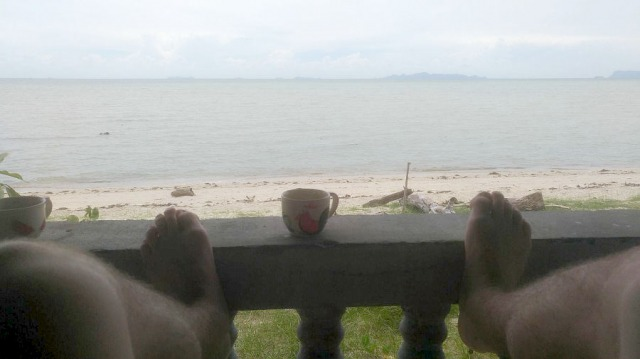
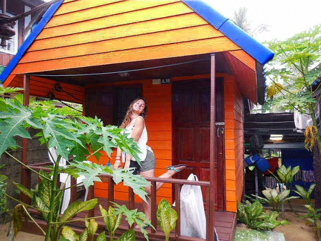
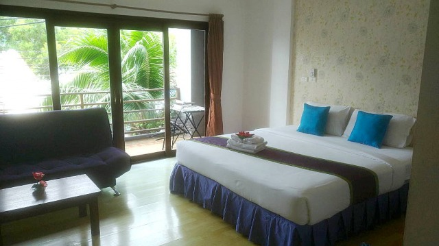
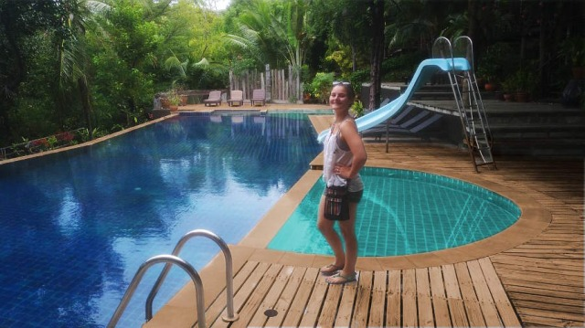
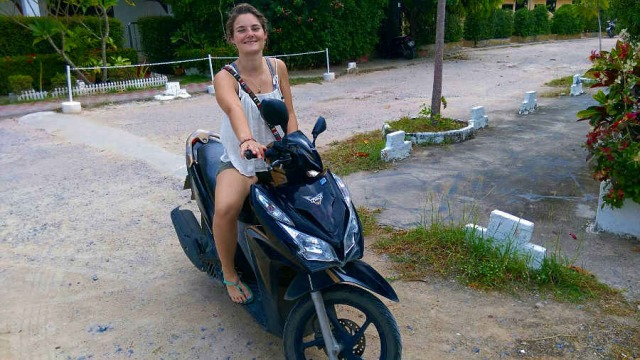

We had originally planned to stay in Chiang Mai for 2 full weeks. We had the foresight however, to only book the first week and assess partway through whether we wanted to continue and book another week at the hostel (or a different one in the city) or move on. We gave this some real consideration but eventually decided that it was, in fact, time to move on. On the recommendations of many, we considered going and spending a little while in Pai, however taking into account Livia's extreme motion sickness and the route to Pai's reputation, we decided against this as well. At long last, we came to a decision: We were ready for some island life!

We've been here for a week now and this is our take on the beaches (areas) of Koh Samui:

#### Nathon Beach
Koh Samui is divided primarily by which beach is the nearest. There are 3 main beaches: Chaweng, Lamai, and Bophut. These are the ones that get the most attention because they are also the largest, but there are also several smaller ones as well. Nathon is a one such beach that doesn't get much attention but is nice in it's own little way. This is where the main pier is for those arriving or departing by ferry and is the reason that we stayed here at all. Venturing into unknown area with a travel itinerary that should have had us showing up late and wondering how to get to our hotel, we chose the safe route and booked a night at the Dream Cat-Cher Hostel, which is a stone's throw from the pier. We lucked out in our travels and ended up arriving several hours early, meaning we got to chat with the awesome host of this hostel as he made us tea while we sat in homemade hammocks watching the ocean.

<b>Unfortunately, this is the only photo we have of this beach</b>
 

Being on exactly the opposite side of the island from the popular areas of Lamai and Chaweng, Nathon is a nice and quiet little area. We were sure glad that we had our first night on this side of the beach to relax after the day of traveling from Chiang Mai. It was just really too bad that we'd only planned to be there one night, we both could have happily relaxed there for a few.

#### Lamai Beach (In a bungalow!)

Following Nathon, we ventured by Songthaew down the southern rim of the island until we reached our place for the next 3 days: a bungalow on the beach! The place is called New Hut and it was an awesome place to stay. Looking back at it from the ocean you see just a long row of multi-colored bungalows with an open-air bar/restaurant placed right in the middle. There are not a lot of finer (and affordable) things in life than waking up without an alarm, walking out your front door in snorkel gear to swim, drying off, and having an iced coffee while reading with the ocean not 20 yards from you. This was the taste of island life that we were after!

#### Chaweng Beach
Chaweng is the largest beach on Koh Samui and thus is the most densely populated. This is both a good and bad thing for us. On one hand, there is all kinds of things to do and restaurants to eat at here. Also there is a greater number of affordable places to stay here. On the other hand, it is much harder to find access to the beach as the areas are all owned by resorts and restaurants. Also there is nowhere that we can find that we can afford to be right on the beach like Lamai.
We did end up finding a really good deal on [Agoda](http://www.agoda.com) for 70% off at the place we stayed though, and although it wasn't right on the beach, it was close enough to everything that we didn't care. 

<b>Plus it had a really nice pool!</b>
 

We thoroughly enjoyed our time here but once again our time was up and we had to move. We arrived at the Lotus Friendly Hotel yesterday and were once again thoroughly impressed. The quality of the rooms in Thailand for the prices are amazing! This is, of course, provided that your definition of a nice room doesn't mean overly upscale. Once above the "regular people living" threshold, expect to pay as much as any other high-end resort.

#### Bophut Beach
Unfortunately, it doesn't look like we're going to be spending any time living in the Bophut Beach region. It is very close to Chaweng though and we have plans to explore as much of it as possible in our upcoming days.

#### What is next?
As far as we can see into the future, which for us is ever-changing, we hope to explore as much of the island as possible on the new scooter that we finally got around to renting. We hope to explore the Big Buddha, Bophut Beach, Toilet in the Mountains (it's exactly what you think it is), and numerous temples and restaurants in the coming days. 

As for where we plan to stay, I have finally found a Muay Thai Gym that I hope to train at for at least a week. After some negotiating, (as is natural and at times necessary in Thailand) I managed to get an excellent rate on a good place for us to stay in the gym's apartment building, with all training costs for both of us included. For the moment, it is looking like I will be the only one of us to make use of this but I'm working hard to convince Liv to give it a try!

That's all for now! I hope to get better at releasing smaller blogs at more regular intervals.... but I wouldn't hold my breath on that.

Thanks for reading!