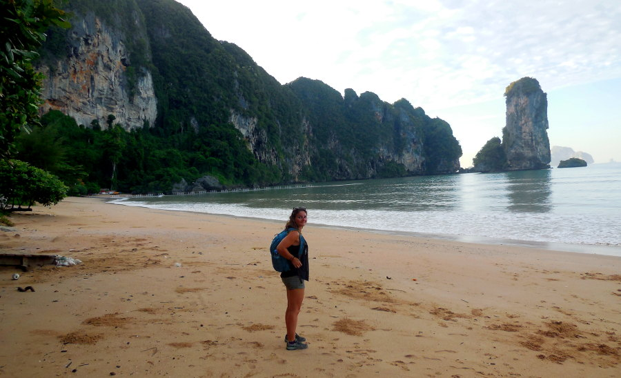

Now Ao Nang Beach is a wonderful place and I could see myself happily spending a lot of time there. But the bulk of what it offers aside from endless food options is its proximity and accessibility to many other attractions. The beach itself is long, clean and provides beautiful views, especially at sunset. It's main issue that we have experienced (and yes, we are part of the problem) is the sheer amount of visitors it has. It is a very busy beach and it is hard to fully relax on. The good news is, we have found the solution!

It comes as a surprise to us that many travellers are unaware that a short walk from one end of Ao Nang Beach will bring you to Pai Plong Bay. This is a beach that is somewhat private to the resort that is the sole occupier of the bay however, the good news is that anyone can come and visit the beach, they just can't enter the resort grounds themselves.

Livia and I first discovered this place by seeing a floating dock in the distance while sitting on the South end of Ao Nang's Beach. We went home later that day and took a look at Google Maps to see what could possibly be on the other side of the rocky outcropping that blocked our view. We saw the words Pai Plong Bay and for the hell of it, we hit the walking directions button and sure enough, we were given this:

<b>I've numbered the key locations on the map to lead you in the right direction.</b>
 

We set off the next morning really early with coffee in hand to try and catch the sunrise in peace and isolation! Chances are, if you're staying in a hotel in Ao Nang Beach your hotel will be somewhere along the main road that ours (Harvest Hotel) was. And if so, you'd be insane to not try eating at this little restaurant called Original Thai Food. Shameless plug for a friend, but these people really are amazing! 

Read what we have to say about them **[here](https://www.canadianwanderlust.com/blog/best-place-to-eat-in-ao-nang-beach?target=_blank).** 

Back to my main point, you will likely have made the walk down to the beach along this road a time or two. When you reach the corner where this road hits the beach **(1)**, there will be a smaller road to your left. You can take this road or, as we did, walk parallel to it on the beach towards the far end of Ao Nang. When the massage parlours along that road end and just before you reach the rocky cliffs, you should look for this bridge **(2)**:

<b>Cross this bridge towards a parking lot</b>
 

Once you cross that, turn right and walk straight until you see this little security booth and the beginning of the walkway **(3)** :

<b>Entrance to the Monkey Trail</b>
 

This is where the trail starts and it is not very long, but there are a lot of steep stairs. If you struggle with steep stair climbs, bring water or look into the longtail taxi rides that can take you there for cheap. These don't run as early though so it will be hard to get the beach to yourself, unfortunately. Now this trail goes up and over the rock face and through a small stretch of the forest. It is a well maintained trail so you don't have to worry about going bushwhacking.

<b>Most of the walkway is like this</b>
 

<b>Walkway through the forest, this is where you'll likely run into monkeys</b>
 

<b>View of the ocean from the walkway</b>
 

**You do** however, have to worry about the monkeys. This is called the Monkey Trail for a reason, and you should take care to secure anything that those little buggers could try and swipe off of you. If the monkeys are bothering you, simply raise your arm like you are getting ready to throw a rock at them and they will usually run off. **Don't try to feed them!**

<b>Long story short, don't litter and don't feed the monkeys!</b>
 

When you reach the end and descend the last flight of rickety wooden steps, the path opens up to a beautiful and , if you go when we did, uninhabited beach! 

<b>A serene beach all to ourselves!</b>
 

The exception being the security guard at the booth right as you come out of the trail who will ask you to sign in and out of the beach, and the sneaky monkeys trying to get into the resort. When we arrived it was absolute bliss, almost nobody else around, beach to ourselves, and nothing to do but admire the view of the limestone cliffs and to relax and enjoy our coffee while listening to the waves crash on the shore. Unfortunately, we didn't consider the fact that if the sunset was so great at night in this direction that the sunrise was clearly going to be happening behind us and and behind the looming limestone cliffs that surrounded us. Nevertheless, it was about as peaceful as it gets! 