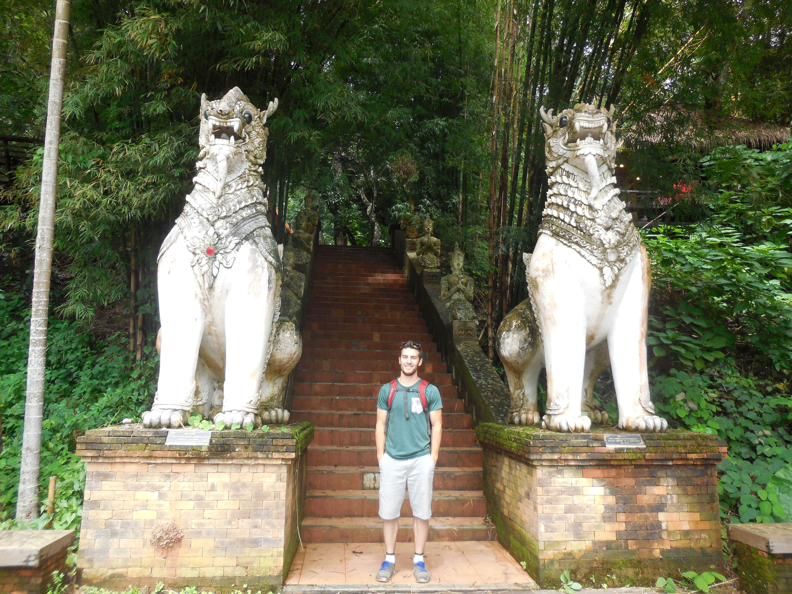
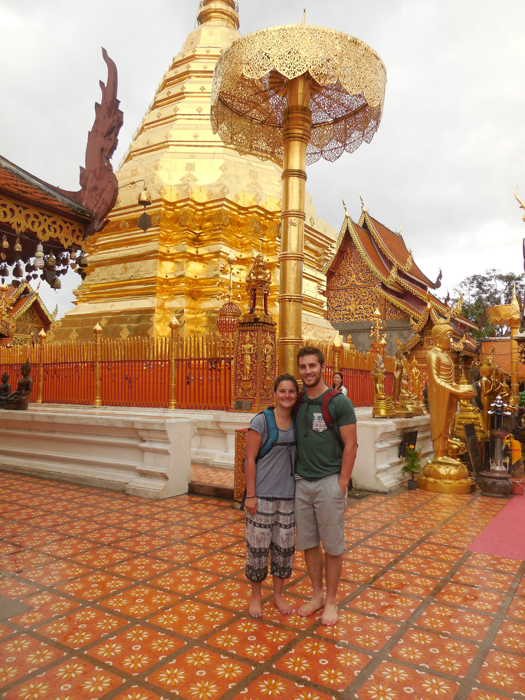

Wat Phra That Doi Suthep is one of Northern Thailand's most sacred temples and is truly a sight to see. The temple is at the top of Doi Suthep Mountaitn in Chiang Mai. While it is possible to take the road up to the base of the temple (by taxi, songthaew, scooter, etc.) we opted to take Monk's Trail. The first real challenge for us was to find the beginning of the trail. Following the directions of numerous bloggers and a lucky run-in with some other travellers heading the same way, we finally found the entrance.

The trail goes runs through the forest at a very mild incline for the first hour and you can easily keep from losing your way by following the endless orange cloths tied on the trees by the monks that walk this trail (as pictured above). The forest is quite similar to those in Canada with the exception of some of the vegetation and something emmiting a high frequency ringing that was at times almost deafening. We never were able to figure out what was causing this. There was nothing really sketchy about this forest except for the one large "thing" that ran past right in front of me, so fast I couldn't tell what it was. After about 45 minutes of hiking we arrived at Wat Pha Lat, a smaller and lesser known temple, which is arguably more beautiful than Wat Doi Suthep at the top. Wat Pha Lat is much less opulent and more serene, tucked away in the forest with waterfalls, shrines, statues, and best of all, a lack of hustle and bustle. It seems that either very few other tourists are aware of this place, or that they are all too lazy to make the hike in. Either way, we were very happy to explore and rest here for a while.

Upon leaving and continuing on the hike, the path got considerably steeper and more difficult but only took us around 35 minutes to reach the top to explore Wat Doi Suthep. This was very clearly a more tourist heavy temple with a lot of people, shops and food stalls everywhere. The temple itself sits at the top of a 306 step staircase with long, ornate dragons running down the sides

When we reached the top of the staircase and paid the 30 baht entrance fee, we entered the temple gates. There was a lot of nice statues outside the main building and a look-out point offering amazing views of all of Chiang Mai (it is a mountain after all), but the main attraction was in the main building of the temple. To enter, everyone must take off their shoes. Inside this area of the temple may have been the most golden statues I have ever seen, and there was about a 50-50 blend of people actually going there to pray and those going just to take pictures. We felt kind of bad being part of the crowd in a place like this just trying to get photos and not quite grasping the significance of it, but we are tourists after all ;). Right in the middle of it all was a giant golden pagoda surrounded by golden and jade buddha statues, burning candles and incense.

For the way back down, you have the option of taking the trail back or taking a taxi or songthaew. We took a songthaew back to Old City and it cost us about $4 CAD total. We were more than happy to take this option after the whole day of hiking and wandering around.

We highly recommend for anyone travelling through Chiang Mai and wanting to visit Wat Doi Suthep to take the time and try Monk's Trail. We both agree that the hike itself and the visit to Wat Pha Lat were a large part of the experience and that just riding to the top would leave you missing out. We're sure glad that we did!
