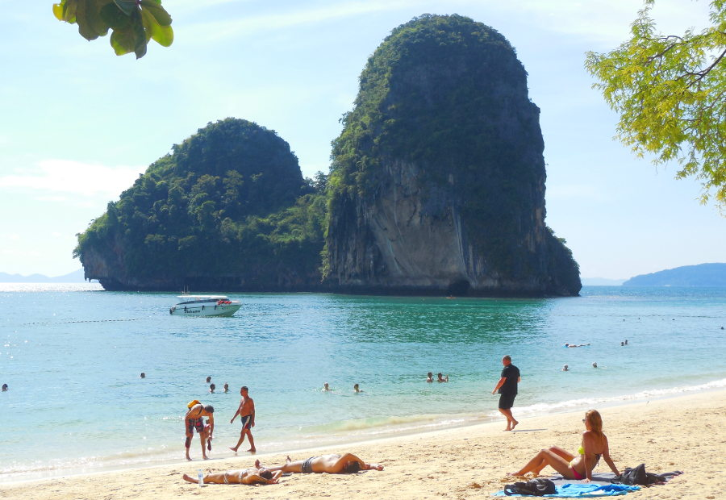

In Krabi province, Thailand, there are 3 main areas that most tourists will visit. These are are Krabi Town, Railay (East and West), and where we stayed primarily, Ao Nang Beach. If you would like to read about our time living in Ao Nang Beach, you can find our post about it **[HERE](https://www.canadianwanderlust.com/blog/taking-a-breather-in-ao-nang-beach?target=_blank)**.

We stayed in Ao Nang Beach area for 2 weeks and while we enjoyed it, one of our favorite days was the one we spent visiting Railay. That said, we only went for one day and don't feel too bad about not going back. Much like Ao Nang Beach it is very nice and is a beautiful area to spend a bit of time with some great things to do, there just aren't very many of them.

Railay is split into 2 areas, the West and the East. Both of which have no vehicles on them so it gives a very chill, island life vibe to them. If you want a place to just relax on the beach or explore some small caves this is a wonderful place. If you decide to stay here, which side you stay on will depend on what kind of traveller you are. If you're looking for high end resort-like accomodations and have some money to spend, you should look into the West. And if you are looking for something a little cheaper, a hippy-paradise, and more backpacker style, you will likely have better luck in the East. Of course both can be found in both sides this is just generally how things are split up here.

We would certainly have stayed on Railay East if we were to stay a few nights there and we actually do have plans to return to stay there later on into our trip when we return to Thailand. This time around however, we only came for a day visit. We got up in the morning and grabbed the first of the many longtail taxi boats from Ao Nang to Railay. Return tickets for the both of us came out to about $8 Cad. After spending the whole day roaming around and doing as many of the things that Railay has to offer as possible, we simply returned to Railay West beach, found a longtail taxi driver and hopped on. Once there was enough people for the trip he took us back. Couldn't be any simpler so if you are staying in Ao Nang we highly recommend the day trip.

Without further adieu, here is our list of 10 things to do in Railay.

##### 10 things to do in Railay
1. ##### Catch some sun on Railay West Beach - Accomplished
*  If you are like us and are coming in by boat, you will likely make your landing on Railay West. This is the most popular of the Railay beaches and will usually be quite busy. Nevertheless, it is a great place to catch some sun, rent a kayak or paddleboard, do some swimming, or have a meal or drink at one of the many open-air restaurants facing the ocean.
 
2. ##### Nightime paddleboarding
*  The "Starlight Tour" offered by Freebird Stand Up Paddleboard Co. allows visitors to do a nighttime paddleboarding tour on the ocean. We really wanted to do this but were unfortunately not staying overnight in the area and couldn't. In our next time through this area we certainly plan to give it a try!

3. ##### Rock-climbing
* Railay is known as a rock-climbing hot spot and this is likely the most popular activity in the area, bringing in enthusiasts from all over the world. The looming limestone cliffs that surround the area offer some of the most incredible rock-climbing in the world, from what I'm told (as a non rock-climber). We both would have really liked to give it a try but we simply didn't have the time or energy to fit it in. Will be another activity for our next time through here :)

4. ##### Diamond Cave - Accomplished
* The Diamond Cave is one activity that we did that was honestly quite underwhelming and we don't really recommend it. I say this because we had heard about how the inside is so beautiful and glimmers like diamonds and such. When we went though, it was really just a cave like any other. There was a walkway that goes a short ways in and then the cave opens up into a large open cavern. Caves are cool but this one didn't really have anything special about it. We would normally recommend it anyways, the only issue we had was that there was an entry fee of 200 baht (the same as it cost us for the longtail taxi to and from Railay)

<b>Diamond Cave</b>
 

5. ##### Have a stare-down with monkeys - Accomplished
*  Roaming through Railay East on our way to check out Phra Nang Cave (see next item) we came across a bunch of cute monkeys playing around at the entrance to a restaurant. We stopped to watch them for a while and Livia caught this perfect picture of me having a stare-off with one of the little guys.

<b>Having a little monkey Stand Off</b>
 

6. ##### Princess Cave (Phra Nang) - Accomplished
* This is one of the main attractions of Railay and unlike the Diamond Cave does not have an entry fee. It is a famous and very peculiar cave though. What makes it so well known is the strange method of worship that goes on here. As odd as it sounds, those wishing to partake will need to find a wooden penis to bring along. The picture below will explain better than words here:

<b>Yep, they are exactly what they look like</b>
 

7. ##### Phra Nang Cave Beach - Accomplished
*  There isn't too much to say about this one. It is a beautiful beach right beside the Phra Nang Cave. It is surrounded by tall limestone cliffs and gives a great little area for swimming with plenty of sun and ample shade. Also usually very busy but is worth checking out.

<b>Phra Nang Beach</b>
 

8. ##### Railay View Point
* If you are full of energy, you can make the climb up to the Railay View Point. We didn't get around to doing this one either in our trip but really wanted to. Onto the list of to-do's for next time it goes. As such, we can't say too much about what this is like other than what we've heard from others. We can point out that it is evident who has just made the climb by the bodies covered in mud trying to wash off in the ocean after.
 
9. ##### Princess Lagoon
* This lagoon is also a main attraction of Railay and can be visited following the climb up to the viewpoint. Another one for the next time to-do. We've heard that your experience of the lagoon will vary a lot based on the season you go so I would look it up before going to see whether it will be worth the climb. In its prime season, this lagoon is beautiful and remote and an iconic image in the area. But in the wrong season it can be little more than a mud pit. Sadly, I am not an expert on this one and can't offer up much more info on it. 

10. ##### "Special" Shakes
* This one shouldn't take much more than a "wink wink". Remember how I mentioned Railay East was hippie-paradise above? Well... wink-wink! This is another that we did not take part in but nonetheless, if you're looking for it it will not be hard to find. For example, one of the bars we walked past on the way between Railay West and East had a big sign saying "Want a trip to the moon? Ask about our Special Shakes". It's not everyone's cup of tea, but with the lifestyle that is offered here, this isn't a big surprise.

So there it is, our recommendation of things to do in Railay. We fully intend to come back here to do all the things that we missed in our first day there, however it won't take more than two or three days total to have tried everything so we definitely recommend visiting here, but don't plan to be here for a long time.