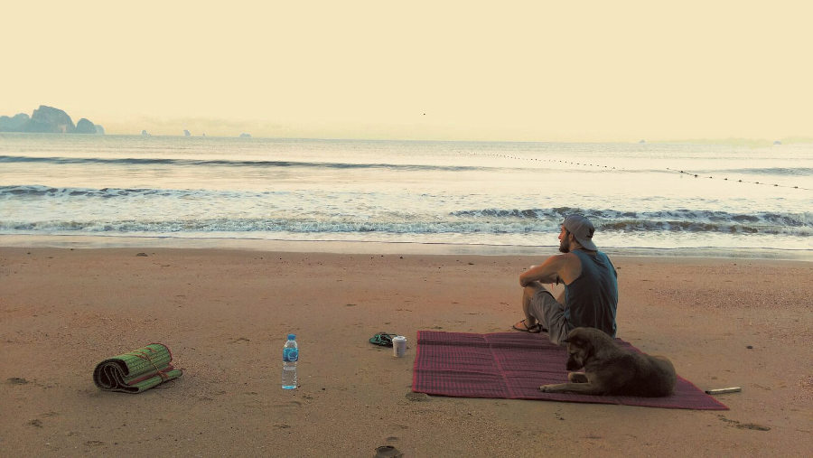
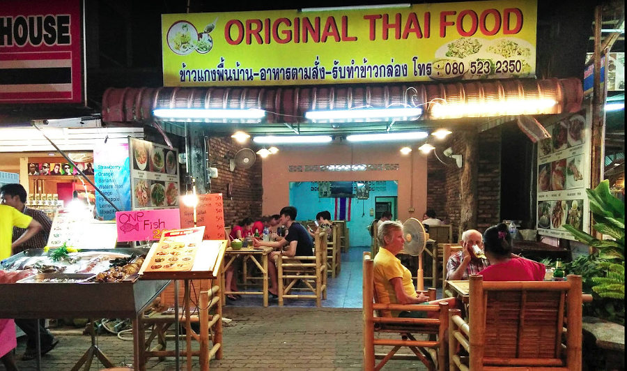
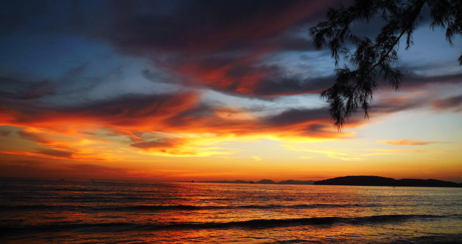

Our journey has led us to Krabi in the southern end of Thailand. More specifically, to the Ao Nang Beach area. We were here for 2 weeks in hopes that being stationary for this long would allow us to get my credit card fiasco taken care of and have a replacement in hand before leaving across the border to Malaysia. Unfortunately, this did not work out and we ended up just staying and living in Ao Nang for a while. I must say though, it was really nice to slow down for a little while and feel what it would be like to stop and live in Thailand instead of the frantic "move around every 3 days" backpacker lifestyle. The only unfortunate bit is that, there really isn't an awful lot to do in Ao Nang without spending a lot of money. 

If one were here on a short vacation and had the luxury of going right back to work after, there would be plenty to do. We however, have the luxury of time within which we plan to be staying much closer to all of these activities and thus, they won't cost as much. With this in mind, we forwent many of the expensive tours to other islands that we are planning on visiting in the future on our trip. 

As such, there isn't going to be too much in this post in the way of super exciting, travelly things in Ao Nang but I will mention the few really cool things we did and go into a bit of detail of what it's like to actually live in a place in Thailand, as this is really our first time experiencing that feeling. 

So I'll start with the cool "travelly" things that we did during our 2 weeks there and it's a bit sad to admit but there were really only 2. Those 2 were awesome though, enough so that we felt they each deserved their own post. Also because trying to fit it all in would have made this one incredibly long ;) They can be found here:
* **[Our numerous visits to Pai Plong Bay](https://www.canadianwanderlust.com/blog/getting-to-pai-plong-from-ao-nang-beach?target=_blank)**
* **[Our day in Railay](https://www.canadianwanderlust.com/blog/our-day-in-railay?target=_blank)**

As for life here in Ao Nang, it is incredibly relaxing, once you get past all of the crazed restaurant owners yelling at you to eat at theirs, and the massage ladies yelling at you to get a massage, and the taxi drivers yelling at you to hire them for a tour. Come to think of it, it's not very relaxing at all. But once you get through it all, down to the end of the road and hit the beach, it is all worthwhile. Being this time in the season, the water is very rough most of the time. This is actually pretty nice though as the waves crashing drowns out the sound of the other tourists around and allows for some peaceful relaxing in the sun, reading or meditating. The rough waters also make swimming a lot of fun if you get out to where you can just float with the waves.

We found quite early on that the most of the craziness and uncomfortable part of living here happened right in the middle of the day, so we found ourselves migrating to an odd sleep schedule during our time here. During the middle of the day, the sun was uncomfortably hot, restaurant and market stall owners were rowdy trying to get business, and the beach was packed. But in the early to mid morning, and from just before sunset until the dead of night everything quieted down a bit. We ended up getting into a bit of a routine of staying up late at night, getting up really early in the morning and staying in the room during the afternoon. Usually Liv would have a nap and I would work on one of my many coding or website building projects.

If you read our above post about Pai Plong Bay, you would get a glimpse into how we liked to spend that stretch of time in the morning. Our favourite thing to do was to get up before the sun, grab a coffee from the 24-hour 7-11 and head down to for some peaceful beach time before the sun and crowds of other tourists would show up. Plus the absolute best time to go swimming was in that short period of time where the sun was up just enough that there was still plenty of shade but before other people began to show up.

<b>Early morning sunrise with my buddy Carlos</b>
 

I make them sound bad, and in some ways they really were, but the real main attraction of Ao Nang was its absolutely insane amount of restaurant options. On the main stretch in Ao Nang on which the majority of hotel and guesthouse options are, the entire walk on both sides of the street has the highest concentration of restaurants I have ever seen. And the restaurants themselves are some of the strangest. For example, there is one that only seems to play old western music, has a Spanish name but colored to look like the Italian flag, and is a Thai, Indian, Mexican, and Italian food place. Quite the identity crisis!

What surprised us the most though, was that amongst this huge array of options, we found what we can confidently claim is the **[Best Restaurant in Ao Nang](https://www.canadianwanderlust.com/blog/best-place-to-eat-in-ao-nang-beach?target=_blank)** quite early on and in the most modest of places. I could go on and on about this place and what gives me the confidence to make such a claim, and in fact I have; in case you missed the last link I'm going to put it in again **[HERE](https://www.canadianwanderlust.com/blog/best-place-to-eat-in-ao-nang-beach?target=_blank)**, just to be sure you don't miss out. These guys really were our favourite part of the long stay here and we still keep in touch as best as we can.

<b>Best Restaurant in Ao Nang</b>
 

We didn't do much in the way of watersport stuff at the beach as it was either surprisingly inaccessable, or wildly overpriced. We had hoped to try paddleboarding but the only place we found to rent was in Pai Plong but it was a part of the resort and only resort guests were allowed to rent. We did however, manage to get our hands on a 2-person kayak for an hour and used it to go exploring the great limestone cliffs a little ways out in the ocean. This was a blast, it was a little hard to get started with all the waves and whatnot but once we got a ways out it was smooth sailing!

[plugin:youtube](https://www.youtube.com/watch?v=qJWDhFsBVJ4)

<b>Good times in Ao Nang</b>
 

And last but not least, one of the major highlights of Ao Nang is that it faces the perfect direction for amazing sunsets! Along the beachfront strip, there are numerous bars and restaurants that face this sunset or you can go and sit either on the rock wall that separates the street from the beach, or go and chill on the beach itself. Depending on where you view this sunset from, at least during the time that we were there, you could either watch the sun set down over the ocean or down behind the huge limestone cliffs that surround the bay. This place certainly ranks in my personal top 5 most beautiful sunsets.

<b>Classic Ao Nang sunset</b>
 

All in all, our having to spend 2 whole weeks here was both a blessing and a curse. We spent a lot of time feeling guilty about being over on this side of the world travelling and "wasting" our time not really doing anything; and the rest of the time overjoyed to save a bunch of money and have some relax time to just live and take it all in. This sort of (earned?) lack of responsibility still feels a bit foreign to us but it is exactly what we were searching for!