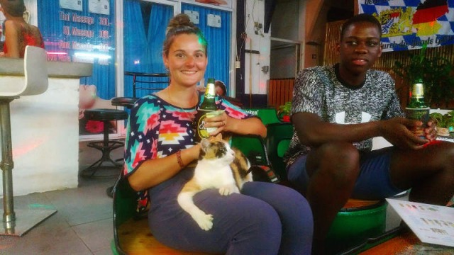

Finally! I finally got my chance to train at an authentic Muay Thai gym in Thailand. For years now I have been a big fan of boxing and Muay Thai as a workout and I have been wanting to try doing proper training. It was actually my main reason for wanting to come to Thailand in the first place. I have done some training at a few places in Victoria, really enjoyed them, and have nothing but good things to say about the trainers in Canada, but nothing really compares to an authentic Muay Thai gym. While we were there we got to watch the #1 Heavyweight Kickboxer in the world, Rico Verhoeven, train at our gym. Matter of opinion I suppose, but I don't think anything validates the quality of the trainers at a gym than that does.

Each day we would have 2 sessions, one in the morning and one in the evening, each 2 hours long. Each session would start with 15-25 minutes of running, skipping, and tire jumping (jumping on a tire straddling the hole in the middle while shadow boxing). Then the rest of the session would consist of bag work, partner training and sparring. At a random time throughout the session, your name was called and you'd get in the ring with one of the trainers for padwork and technique training. This consisted of 5x3 minute rounds and was an absolute killer. 

[plugin:youtube](https://www.youtube.com/watch?v=ysM_YcSBXhY)

<b>Padwork at the end of an evening session</b>
 

Needless to say, it takes some getting used to going from not hitting the gym at all for a while to training that long, often and intensely, all in 30+ degree heat. Of all the training for all the sports I've played in my life, I don't think I've ever been so sore and sweaty! The days were long and exhausting but it was so worth it. 

<b>Thank God for this pool!</b>
 

The experience far surpassed what I had hoped for both in and out of the gym. Living in the on-site accommodation, we got to share the experience and became friends with many really cool people from all over the world (America, Holland, Netherlands, Germany, and Zimbabwe). With this small group, we did almost everything together for the week that we were there. Although truth be told, if it wasn't for Livia, we would probably not have left our beds except for training sessions. Koh Samui is such a cool island with so much to see and do and of course we were always happy to have experienced parts of it, but it can't have been easy for her to keep our lazy asses from crawling back to our beds after training! 

Since she was the evil mastermind who so ruthlessly forced us to go do these (admittedly awesome) things, I'm gonna pass it off to Livia to explain why these things were worth keeping us from our glorious rest ;)
 
1. #####Hin-Ta and Hin Yai and Rock Bar
* These are quite the tourist attraction, so we decided to see what all they hype was about for ourselves. It's a little bit funny but the whole reason for these are an attraction is that there are two rock formations that look like male and female genitalia.

<b>Hin Ta or "Grandfather Rock"</b>
 

They were pretty neat and in a beautiful location, but that wasn't the best part. The best part was the cool little hidden reggae bar called Rock Bar. There were no chairs or walls, just little cushions you could sit on and mini coffee tables all painted in rasta colors located right next to the ocean. We stayed there for quite some time sipping lattes and eating sandwiches. It started to rain while we were there, so luckily there was a roof and it was all very cozy. The two random dogs that laid beside us the entire time also helped make it that much better. 

<b>Ordering a drink at Rock Bar</b>
 

2. #####Ninja Crepes
* This is a little restaurant my lonely planet book had recommended. The prices were great but I ordered coconut soup which was weirdly sour and sweet and creamy all at the same time. It also had some mysterious vegetables in it that were pretty gross to be honest. Tim had the Ninja Crepe which was just mango and sticky rice in a crepe but he loved it. If I had made a better food choice this place would have been great and I would definitely go again. 
3. #####Stacked
* We decided to try another restaurant my book had recommended so we went to a place called Stacked. All that I have to say about this place is that the food is delicious, but you also pay a fair amount for it. For Thailand standards at least, but the burgers are worth the extra cost. Trust me. 
4. #####Ark Bar
* There's a fairly well known bar on Koh Samui called Ark Bar, but I don't really understand what all the excitment is about. We were only there for about 15 minutes. The beach that the bar is on is really nice but there was a jelly fish warning, which I know is not their fault but it still makes you a little nervous to go in the water. The drinks are also way overpriced, and you feel obligated to buy something if your going to use their part of the beach. We're pretty cheap people which is why we left in such a hurry. They do have weekly parties there however that actually sound quite fun. I would just make sure to predrink beforehand if your as cheap as we are. 
5. #####Reggae Bar
* Another well known bar on the island is called Reggae bar but we only saw this quickly in passing. It's huuuuuggee and it looks really cool but it apparently only gets going around midnight and we were there way to early for it to be exciting. 
6. #####Fisherman's Village
* There's a famous little village called Fishermans Village that we were told we had to check out. It's nothing to special on a normal day but the Friday market is something worth experiencing. A group of us went to eat supper there and there were endless choices of food. I wish I had a bigger stomach for these kind of situations. I had a burrito right off the bat, which was amazing but also filling, which in this case was not a good thing since there was still so many things to try! But I went on to have some sushi, and then deep fried potato chips with cheese and then tried a couple bites of crocodile! It was pretty chewy. There was still endless amounts of cheap food to try but unfortunetly I was too stuffed. 

<b>Entrance to Fisherman's Village</b>
 

7. #####Wat Phra Yai / Big Buddha
* We also went to check out the Big Buddah. It sure is big. You can check it out in the short video. 

[plugin:youtube](https://www.youtube.com/watch?v=RlZ_RVX_5Lw)
8. #####Wang Sao Thong Waterfall and Mountain Grand Seaview pool
* We met some pretty cool people at the camp Tim was training at. One day all of us went on a little excursion with a few scooters to the top of a mountain. Halfway up we stopped at a little waterfall called Wang Sao Thong. We had to make a small hike up from the little parking lot to reach the waterfall, and a small hike down to reach a natural pool. 

<b>Rest area between the waterfall and natural pool</b>
 

When we were done here, we continued on to the top of the mountain. There's a restaurant at the top which has a beautiful inifinity pool which we were allowed to use for a whopping $3.76 each. We made sure to stay for at least 3 hours to get our moneys worth. 

<b>Enjoying the infinity pool</b>
 

9. #####Going away night out
* For our last day at Superpro a bunch of us decided to go out and watch a couple Mauy Thai fights that were happening at the stadium not far from where we were staying. Very cool. After the fights we went to a bar called Camp Beer, where one of Tim's trainers was at as well as a bunch of others that were still currently training at Superpro. Next we made our way to another famous bar called the Green Mango Club. Pretty cool place and massive with a few different DJ booths, but really just your typical old club. And finally for our last stop of the night we headed to a strange place called the White Massage. Weird place. It was supposed to be a massage parlor but also a bar...I think. It was closed when we got there at 2am, but the owner came and opened it up for us. There was an adorable cat there that came and slept on my lap for a bit. Highlight of my night. We stayed until 4:30am and finally went home to get some rest before leaving for Koh Tao the next morning. 

<b>Best kind of drinking buddy!</b>
 